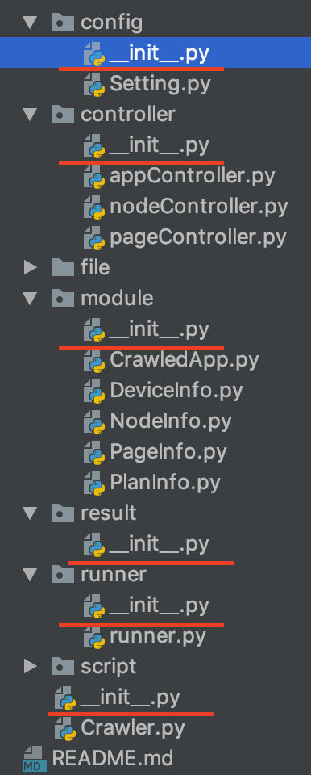
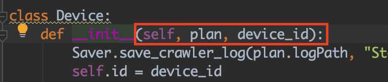
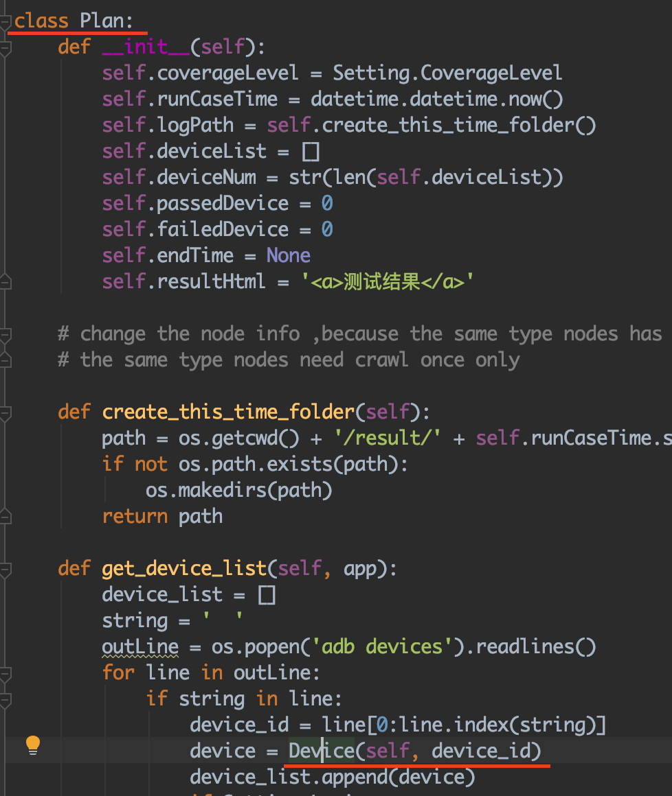
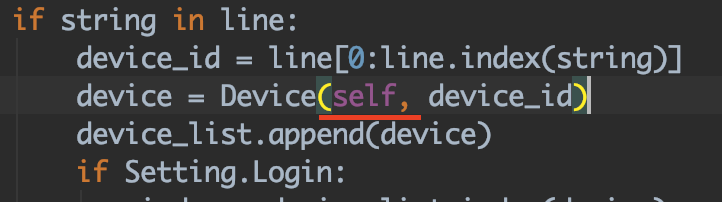

# Python项目编码习惯

## 1. Python 命令行参数和getopt模块

官方文档：https://docs.python.org/3.1/library/getopt.html

主要经常使用getopt这个函数，那下面我们先瞧瞧这个家伙有哪些参数吧！

> getopt.getopt(*args*, *shortopts*, *longopts=*[])
>  args指的是当前脚本接收的参数，它是一个列表，可以通过sys.argv获得
>  shortopts 是短参数　　啥是短参数啊？　　类似于　这样：python test.py -h # 输出帮助信息
>  longopts  是长参数　　啥是长参数啊？　　类似于　这样：python test.py -help # 输出帮助信息

可能你已经明白一点了，但是重要的还在后面，那就是此函数的返回值

##### 返回值

这个函数返回是一个两元组的列表（复习一下，元组的值是不可修改的！）
 下面我写一个小例子，让你稍微顿悟一下

```
import getopt
import sys

arg = getopt.getopt(sys.argv[1:],'-h',['help'])
print(arg)
```

结果如下：

```
root@Kali:~/python# python3.5 test.py -h
([('-h', '')], [])
root@Kali:~/python# python3.5 test.py --help
([('--help', '')], [])
root@Kali:~/python# 
```

可以看到已经接收了参数。并且做了处理，为啥我传入sys.argv[1:]？

> 因为sys.argv里的argv[0]是当前脚本的文件名，不需要它去参与，要不然你的选项和选项值无法匹配，问题多多。
>  假设我要接收一个参数+参数值的选项怎么办？

再写个小例子！

```
#!/usr/bin/env python3.5
import urllib.request
import getopt
import sys

opts,args = getopt.getopt(sys.argv[1:],'-h-f:-v',['help','filename=','version'])
for opt_name,opt_value in opts:
    if opt_name in ('-h','--help'):
        print("[*] Help info")
        exit()
    if opt_name in ('-v','--version'):
        print("[*] Version is 0.01 ")
        exit()
    if opt_name in ('-f','--filename'):
        fileName = opt_value
        print("[*] Filename is ",fileName)
        # do something
        exit()
```

运行测试结果如下：

```
root@Kali:~/python# python3.5 test.py --filename=test
[*] Filename is  test
root@Kali:~/python# python3.5 test.py --filename=
[*] Filename is  
root@Kali:~/python# python3.5 test.py --help
[*] Help info
root@Kali:~/python# python3.5 test.py --version
[*] Version is 0.01 
root@Kali:~/python# python3.5 test.py -v
[*] Version is 0.01 
root@Kali:~/python# python3.5 test.py -f test
[*] Filename is  test
root@Kali:~/python# 
```


## 2. 项目如何配置化

### 方法一

借助configParser模块解析纯文本的配置文件，参考dev-task项目

### 方法二

将配置参数单独写成一个python文件，其他文件可以import该文件，配置参数就成了变量。

参考AUICrawler项目


## 3. 如何优雅地import自己写的文件

### 以前的做法

直接将自己写的python文件保存为my_file.py，然后其他文件中直接import my_file

有两个缺点：

- IDE中代码检查不合格，会报红色error
- A.py需要import my_file，则my_file.py只能放在A.py的同级目录
- 如果my_file.py文件被多个文件import，则无法应付多层级结构

造成这些缺点的原因是：不合理地import自己的文件

### 正确的做法

将自己写的工具类型的python文件，放在一个config文件夹中，并写入一个`__init__.py`文件。这样的话，config文件夹就成了一个模块，可以在其他文件中`from config import my_file`等这类操作。



## 4. 类、类变量、实例变量、方法的命名风格

保持一种特定的约定即可，比如PEP8


实践中，可以采用以下约定：

- 类采用驼峰法命名
- 类变量采用驼峰法命名
- 实例变量采用下划线法命名
- 方法采用下划线法


## 5. A类的一个方法中初始化B类实例对象，B类初始化入参含有A实例对象，则在A类的该方法传入self








## 6. 当项目中对类型的判断较多且严格时，采用types模块或者isinstance（object, classifo）函数

#### types是什么：

- types模块中包含python中各种常见的数据类型，如IntType(整型)，FloatType(浮点型)等等。

```python
>>> import types

>>> dir(types)
['BooleanType',
 'BufferType',
 'BuiltinFunctionType',
 'BuiltinMethodType',
 'ClassType',
 'CodeType',
 'ComplexType',
 'DictProxyType',
 'DictType',
 'DictionaryType',
 'EllipsisType',
 'FileType',
 'FloatType',
 'FrameType',
 'FunctionType',
 'GeneratorType',
 'GetSetDescriptorType',
 'InstanceType',
 'IntType',
 'LambdaType',
 'ListType',
 'LongType',
 'MemberDescriptorType',
 'MethodType',
 'ModuleType',
 'NoneType',
 'NotImplementedType',
 'ObjectType',
 'SliceType',
 'StringType',
 'StringTypes',
 'TracebackType',
 'TupleType',
 'TypeType',
 'UnboundMethodType',
 'UnicodeType',
 'XRangeType',
 '__all__',
 '__builtins__',
 '__doc__',
 '__file__',
 '__name__',
 '__package__']
```

### types的缺点

如果是判断自定义类（该类继承基础类比如int），那个该自定义类的示例对象可能不是types.IntType. 所以推荐isinstance（object, classifo）函数来替代。