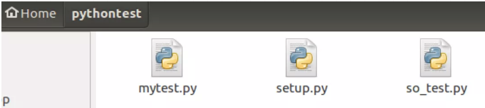
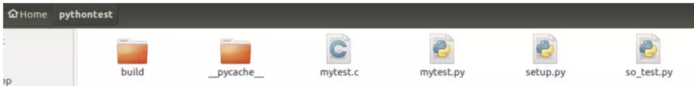
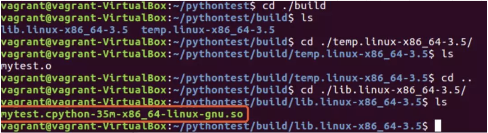
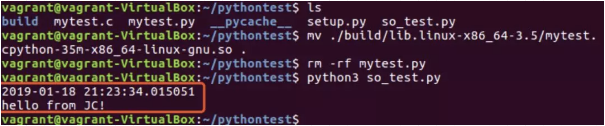

# 为Python程序加密(运行脚本,但源码不会被看到)

## 需求

在实际的工作中，有时候我们需要部署自己的Python应用，但这时候我们并不希望别人能够看到自己的Python源程序。因此，我们需要为自己的源代码进行加密，Python已经为我们提供了这样一套工作机制。

## 方法

### 方法一

第一种加密Python源代码的方式，是将.py文件转化为.pyc文件，但这种加密方式很容易被反编译，因此实用性并不高。

### 方法二

第二种加密Python源代码的方式，是将.py文件转化为.so文件，这样加密的可靠性非常高，无法被被人破解，也就很好地保护了源代码。

## 操作步骤

以Linux系统(Ubuntu)为例，讲解如何将自己的Python程序（.py文件）加密为.so文件。

首先，我们需要在Ubuntu系统中安装一些准备工具，包括python3-dev，gcc，Cython,其中Cython为Python的第三方模块。安装的命令如下：

```
$ sudo apt install python3-dev gcc
$ pip3 install cython
```

接着，我们新建pythontest文件夹，用于测试我们的代码，文件夹的内容如下：

- mytest.py
- setup.py
- so_test.py



其中，mytest.py为我们需要加密的Python程序,setup.py为加密的脚本。mytest.py的代码如下：

```python
import datetime

class Today():
    def get_time(self):
        print(datetime.datetime.now())

    def say(self):
        print("hello from JC!")
```

加密脚本setup.py的代码如下：

```python
from distutils.core import setup
from Cython.Build import cythonize

setup(ext_modules = cythonize(["mytest.py"]))
```

测试代码so_test.py的代码如下：

```python
from mytest import Today

t = Today()
t.get_time()
t.say()
```

切换至pythontest文件夹，先运行so_test.py脚本（为了显示时间，便于跟后面的程序区分），再运行setup.py对mytest.py程序加密，命令如下：

```
$ python3 so_test.py
$ python3 setup.py build_ext
```

输出如下：

```
2019-01-18 21:15:21.126709
hello from JC!
```

运行完加密命令行（python3 setup.py build_ext）后，文件夹中的文件如下：



在build文件夹中，有我们需要的so文件，如下：



生成的so文件一方面对我们的源程序进行了加密，另一方面，我们还能继续调用原来的mytest.py文件中的内容。为了验证此功能，我们先删除mytest.py，再运行so_test.py文件，如下：



可以发现，我们删除了mytest.py文件，即源代码，但so_test.py文件可以正常调用源程序的内容，这是因为，两次运行so_test.py的输出时间不一样。

总结：在实际的工作中，我们可以按照上面的方法将.py程序加密为.so文件，当然也可以写个脚本实现更复杂的功能。

