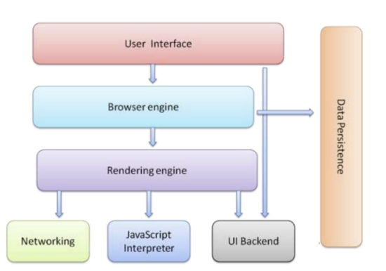
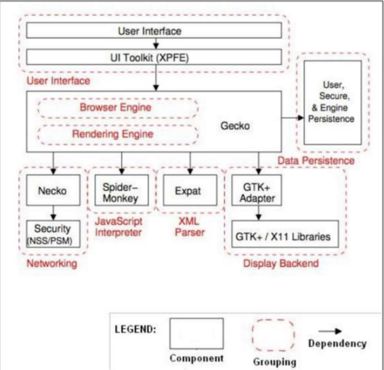
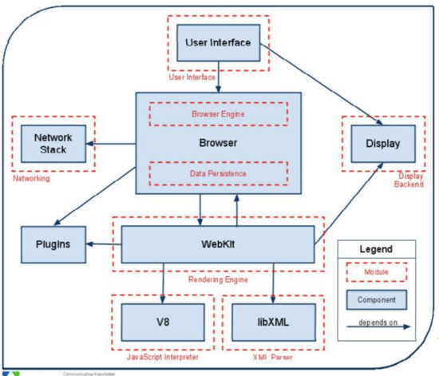
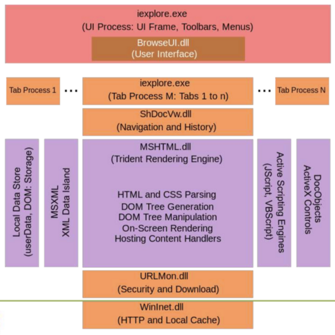
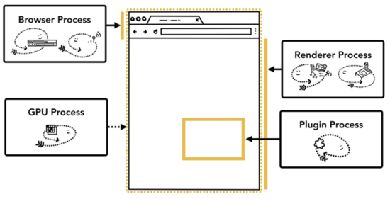
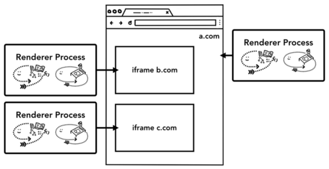

在从事前端开发过程中，浏览器作为最重要的开发环境，浏览器基础是是前端开发人员必须掌握的基础知识点，它贯穿着前端的整个网络体系。对浏览器原理的了解，决定着编写前端代码性能的上限。浏览器作为JS的运行环境，学习总结下现代浏览器的相关知识

### 前言

经常听说浏览器内核，浏览器内核究竟是什么，以及它做了什么。我们将来了解下浏览器的主要组成部分、现代浏览器的主要架构、浏览器内核、浏览器内部是如何工作的

### 1 浏览器

现代浏览器结构如下：



The browser's main component

#### The User Interface

主要提供用户与Browser Engine交互的方法。其中包括：地址栏(address bar)、向前/退后按钮、书签菜单等等。浏览器除了渲染请求页面的窗口外的所有地方都属于The User Interface

#### The Browser Engine

协调（主控）UI和the Rendering Engine，在他们之间传输指令。 提供对The Rendering Engine的高级接口，一方面它提供初始化加载Url和其他高级的浏览器动作（如刷新、向前、退后等）方法。另一方面Browser Engine也为User Interface提供各种与错误、加载进度相关的消息。

#### The Rendering Engine

为给定的URL提供可视化的展示。它解析JavaScript、Html、Xml，并且User Interface中展示的layout。其中关键的组件是Html解析器，它可以让Rendering Engine展示差乱的Html页面。 值得注意：不同的浏览器使用不同的Rendering Engine。例如IE使用Trident，Firefox使用Gecko，Safai使用Webkit。Chrome和Opera使用Webkit（以前是Blink）

#### The Networking

基于互联网HTTP和FTP协议，处理网络请求。网络模块负责Internet communication and security，character set translations and MIME type resolution。另外网络模块还提供获得到文档的缓存，以减少网络传输。为所有平台提供底层网络实现，其提供的接口与平台无关

#### The JavaScript Interpreter

解释和运行网站上的js代码，得到的结果传输到Rendering Engine来展示。

#### The UI Backend

用于绘制基本的窗口小部件，比如组合框和窗口。而在底层使用操作系统的用户界面方法，并公开与平台无关的接口。

#### The Data Storage

管理用户数据，例如书签、cookie和偏好设置等。

### 2 主流浏览器的架构

#### 2.1 FireFox

 

FireFox的架构

可以看到火狐浏览器的渲染引擎（Rendering Engine）使用的是Gecko；XML Parser解析器是Expat；Java Script解释器是Spider-Monkey（c语言实现）

#### 2.2 Chrome



Chrome的架构

渲染引擎Rendering Engine使用的是WebKit

XML Parser： libXML解析XML，libXSLT处理XSLT

JS解释器使用C++实现的V8引擎，

#### 2.3 IE



IE的架构

渲染引擎主要是Trident

Scripting Engine有JScript和VBScript

### 3 浏览器内核

浏览器最重要或者说核心的部分是“Rendering Engine”，可大概译为“渲染引擎”，不过我们一般习惯将之称为“浏览器内核”。主要包括以下线程：

#### 3.1 浏览器 GUI 渲染线程，主要包括：

```
 CSS Parser 解析Style数据，包括外部的CSS文件以及在HTML元素中的样式，用于创建另一棵树，调用“Render Tree”
 Layout过程 为每个节点计算出在屏幕中展示的准确坐标
 Painting 遍历Render Tree，调用UI Backend提供的接口绘制每个节点
```

#### 3.2 JavaScript 引擎线程

JS引擎线程负责解析Javascript脚本，运行代码 JS引擎一直等待着任务队列中任务的到来，然后加以处理，一个Tab页（renderer进程）中无论什么时候都只有一个JS线程在运行JS程序

GUI渲染线程与JS引擎线程是互斥的，所以如果JS执行的时间过长，这样就会造成页面的渲染不连贯，导致页面渲染加载阻塞

```
a) 减少 JavaScript 加载对 DOM 渲染的影响（将 JavaScript 代码的加载逻辑放在 HTML 文件的尾部，减少对渲染引擎呈现工作的影响；
b) 避免重排，减少重绘（避免白屏，或者交互过程中的卡顿；
c) 减少 DOM 的层级（可以减少渲染引擎工作过程中的计算量；
d) 使用 requestAnimationFrame 来实现视觉变化（一般来说我们会使用 setTimeout 或 setInterval 来执行动画之类的视觉变化，但这种做法的问题是，回调将在帧中的某个时点运行，可能刚好在末尾，而这可能经常会使我们丢失帧，导致卡顿）
```

#### 3.3 浏览器定时触发器线程

浏览器定时计数器并不是由 JavaScript 引擎计数的, 因为 JavaScript 引擎是单线程的, 如果处于阻塞线程状态就会影响记计时的准确, 因此通过单独线程来计时并触发定时是更为合理的方案

#### 3.4 浏览器事件触发线程

当一个事件被触发时该线程会把事件添加到待处理队列的队尾，等待 JavaScript 引擎的处理。这些事件可以是当前执行的代码块如定时任务、也可来自浏览器内核的其他线程如鼠标点击、AJAX 异步请求等，但由于 JavaScript 的单线程关系所有这些事件都得排队等待 JavaScript 引擎处理。

#### 3.5 浏览器 http 异步请求线程

在 XMLHttpRequest 在连接后是通过浏览器新开一个线程请求， 将检测到状态变更时，如果设置有回调函数，异步线程就产生状态变更事件放到 JavaScript 引擎的处理队列中等待处理。

### 4 以Chrome浏览器为例，演示浏览器内部如何工作

上面铺垫了这么多理论，下面结合Chrome讲解当用户在地址栏上输入URL后，浏览器内部都做了写什么

#### 4.1 Chrome浏览器中的多进程

打开Chrome 任务管理器，可以看到Chrome运行的进程



各个进程的功能

• Browser进程

功能：Controls "chrome" part of the application including address bar, bookmarks, back and forward buttons. Also handles the invisible, privileged parts of a web browser such as network requests and file access.

• GPU进程

功能：Handles GPU tasks in isolation from other processes. It is separated into different process because GPUs handles requests from multiple apps and draw them in the same surface.

• 第三方插件进程

功能：Controls any plugins used by the website, for example, flash. 每个插件对应一个进程，当插件运行时创建

• 浏览器渲染进程

功能：Controls anything inside of the tab where a website is displayed. 默认每个标签页创建一个渲染引擎实例。

• V8 Proxy resolver

关于V8 Proxy resolver可查看

[code.google.com](https://code.google.com/p/chromium/issues/detail?id=11746)

group.google.com [https://groups.google.com/a/c...](https://groups.google.com/a/chromium.org/forum/#) !topic/net-dev/73f9B5vFphI

[doc.google.com](https://docs.google.com/document/d/1n5hr4KJhZl2A4MicTfmyiHPdiKp7kmUoWXnRBN8SrZE/edit#)

Chrome支持使用代理脚本为给定的网址选择代理服务器，包含使用操作系统提供的代理解析程序的多个平台的回退实现。但默认情况下（iOS除外），它使用内置的解析V8执行代理脚本（V8 pac）。今天（截至2015年1月），V8 pac在浏览器进程中运行。这意味着浏览器进程包含一个V8实例，这是一个潜在的安全漏洞。在浏览器进程中允许V8还需要浏览器进程允许写入 - 执行页面。

我们关于将V8 pac迁移到单独进程的建议包括为解析器创建Mojo服务，从实用程序进程导出该服务，以及从浏览器进程创建/连接到该进程。

浏览器进程之间主要通过IPC (Inter Process Communication)通信

#### 4.2 Per-frame renderer processes - Site Isolation

Site Isolation is a recently introduced feature in Chrome that runs a separate renderer process for each cross-site iframe. We’ve been talking about one renderer process per tab model which allowed cross-site iframes to run in a single renderer process with sharing memory space between different sites. Running a.com and b.com in the same renderer process might seem okay. The Same Origin Policy is the core security model of the web; it makes sure one site cannot access data from other sites without consent. Bypassing this policy is a primary goal of security attacks. Process isolation is the most effective way to separate sites. With Meltdown and Spectre, it became even more apparent that we need to separate sites using processes. With Site Isolation enabled on desktop by default since Chrome 67, each cross-site iframe in a tab gets a separate renderer process.

 

每个iframe是单独的渲染进程