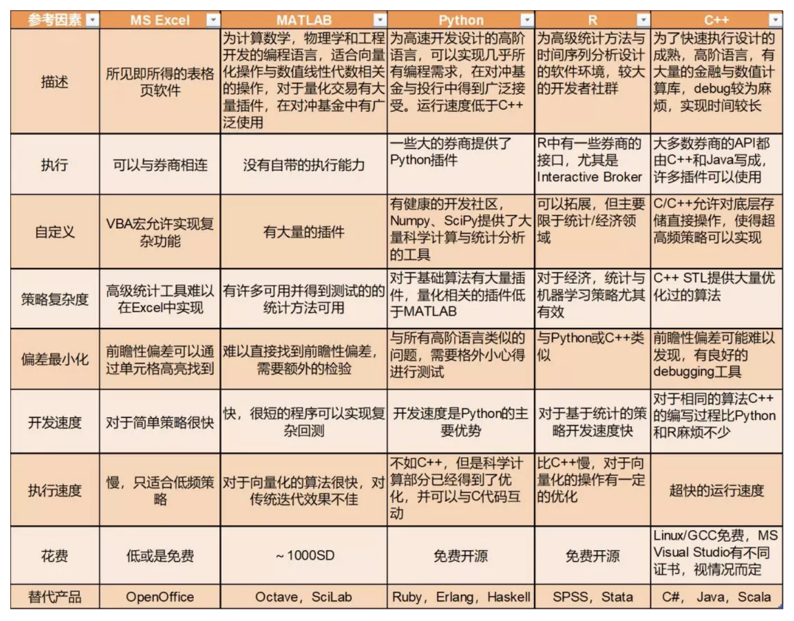

# 年化1000%？！什么才是回测的正确姿势之系列一

来源：挖地兔

算法回测需要各式各样的知识，涵盖了心理学，数学，统计，软件开发以及市场微观结构等诸多领域。我们不期望在这短短的一篇文章中覆盖所有的主题，因此我们将分两三期来介绍这一主题。在这一期中，我们将会从回测的定义入手，进而说明实现回测的基础。之后我们将解释回测过程中的偏差，最后对可以进行回测的不同软件进行比较。

在之后的几期中我们将更加深入的检视那些策略实现中常常被忽略的细节。同时通过考虑交易所的特质让回测过程更加贴近现实。之后我们会讨论交易成本，以及如何在回测中对其正确地建模。最后我们将会讨论如何评估回测表现，并以常见的均值回归配对交易策略为例子进行分析。

现在就让我们开始讨论什么是回测，以及如何对我们的算法交易进行回测。本文内容概览如下：

**一、什么是回测？**

**二、影响策略回测的偏差**

**三、不同回测软件对比**

## 一、什么是回测？

算法交易与其他交易类型的重要区别在于：算法交易能利用大量的数据，更好地通过分析某个时间点前的历史来预测之后的表现。而实现这一目的的过程，就叫回测。

 

**简单来说，回测就是将你的交易算法应用到一段历史数据中，并产生一系列的交易信号，其产生的一系列交易会产生一系列的收益或损失。**在策略回测范围中的一系列收益/损失最终会累积为总收益/损失,也称为P&L。这就是回测的重点，尽管还有许多的细节需要介绍。那么有**哪些关键的原因使得对算法策略进行回测如此重要呢**？

**【过滤】**我们希望过滤掉不满足特定条件的策略，而回测提供了一个筛选机制来帮助我们筛去那些表现不能满足需求的策略。

**【建模】**回测可以让我们测试关于特定市场现象的新模型，例如交易成本，买卖盘传递，延迟，流动性或者其他市场微观结构。

**【优化】**尽管策略优化可能充满了偏差，回测允许我们通过修正策略相关参数来提升策略表现。

**【验证】**我们采用的策略经常从外部得到，回测可以验证这些策略得到了正确的实现。尽管我们无法得到外部策略产生的交易信号，但是往往可以获取例如夏普比率和回撤率等特征。因此可以通过比较检查自己的实现。

## 二、影响策略回测的偏差

回测尽管为算法交易提供了一系列好处，但是对一个策略的回测往往不是简单直接的。一般来说，随着策略频率的提高，对市场和交易的微观结构正确建模变得更加困难。这使得回测变得更不可靠，同时使得对给定策略的评估变得更加复杂。对于那些交易执行系统是策略表现关键因素的策略来说，譬如超高频算法，这个问题尤其重要。

很不幸的是，回测往往会被各式各样的偏差干扰，我们现在就来讨论这个问题。

有许多偏差都会为影响策略在回测中的表现，这些偏差往往会高估策略的表现。因此，我们往往将回测视为一个策略在真实市场中实际表现的理想上界。想要从算法交易中完全剔除偏差是不可能的，但是我们可以尽力减少策略中的偏差并对算法策略做出判断。在这里我们一共讨论四种主要的偏差：**优化偏差、前瞻性偏差、幸存者偏差、心理容忍偏差。**

### 优化偏差

这可能是所有回测偏差中最隐蔽的偏差了。它源自于对**额外交易参数的调整或者引入**，直到对回测数据集的算法表现十分优秀。但是此时策略的实际表现往往会不同于预期。这种偏差又称为曲线拟合或者数据透视偏差。

由于算法策略常常包括许多参数，因此很难完全消除优化偏差。在这里，参数可以是出入条件，回溯周期，平均周期（例如移动平均光滑参数）或是波动率测量频率。我们可以通过精简参数数量，提高数据集中数据点质量来降低优化偏差。事实上,十分值得注意的一件事是，旧的数据点有可能遵从以前的范式， 对于现在的策略来说没什么意义。

一种有助于降低优化误差的方法是进行**敏感度分析**，即对参数做一系列的变化并绘制出策略表现在参数空间的超曲面。**一个合适的参数选择应当产生一个光滑的参数表面**，**如果你得到的策略表现是一个上蹿下跳的曲面，那么说明这样的参数并没有反映普遍的现象，而只是从测试数据中硬造出来的一个指标**。

关于多维优化算法有许多的文章，同时也是研究的热门领域。在这里我们并不会继续深入，但是希望大家在找到一个有着超神回测的策略时可以多留一个心眼。

### 前瞻性偏差

前瞻性偏差来自于在回测系统中**意外使用了未来的数据。**当我们的回测运行到时间点N时，如果使用了时间点在N+k(k>0)的数据，就会引入前瞻性误差。前瞻性误差有时会极其的微妙。这里给出几个前瞻性误差产生的例子：

**【技术Bug】**代码中的array或vector往往有迭代器或是指标变量，错误的指标偏移量可能读取未来的数据而产生前瞻性误差。

**【参数计算】**另一个常见的前瞻性偏差例子在计算策略优化参数时产生，例如计算时间序列的线性回归。如果所有的数据点都用于回归参数的计算，就会将未来的数据包括在内。

**【极大/极小】**一些交易策略会利用一段时间内的极值。但是鉴于极大极小等极值只有在一个时间段完成之后才能计算，如果在这个时间段中使用这些参数就会带来前瞻性误差。对极值的使用往往要延后至少一个时间段才能使用。

与优化偏差类似，我们必须十分小心以避免前瞻性误差的引入， 这也往往是一些交易策略在实际交易中表现不佳的主要原因。

### 幸存者偏差

幸存者偏差是一个极其危险的现象，并会大大高估特定策略类型的表现。**当一个策略在测试时没有包括当时所有可选资产，而是只从现在已经“幸存”那些资产中选取。**

举例来说， 如果随机选取标的，对一个策略在2001年市场崩溃前后进行测试。一些科技股直接破产，而另一些则挺了过来，甚至实现了增长。如果我们在选择股票进行策略测试时**只选取那些从市场回落中幸存的那些股票**，我们**就会引入幸存误差，因为这些股票已经证明了自己的成功**。事实上，**这就是前瞻性误差的一个特例**，其核心在于未来的信息掺到了对过去的分析中。有两种方法可以避免幸存偏差对策略回测的影响：

**【无幸存偏差的数据集】**尽管价格不菲，并往往只有研究机构会使用，对于股票的情况可以试着购买包括了除名公司的数据集。**特别要注意的是，Yahoo经济数据就不是剔除幸存者偏差的数据集，而且被退休算法交易员广泛使用**。另一方面可以**选择针对没有幸存偏差的标的进行交易**，比如一些大宗商品及其期货衍生品。

**【采用近期的数据】**只用近期的数据可以部分移除幸存者效应的权重， 这只是基于短期内股票被除名的概率极小。也可以从现在开始构建个人的无幸存者偏差数据集，在3-4年后就可以获得一个可靠的数据集来实现未来的策略回测了。

 

### 心理容忍偏差

现在我们来考虑心理学现象如何影响你的交易表现。这一现象不只是讨论量化交易，而是扩展到更加任意的交易方式。这一现象有各种不同的叫法，在这里我们将其称为心理容忍偏差，这一名称更好地反映出了问题的实质。

在对过去五年或更长时间的时间进行回测时，很容易得到向上增长的净值曲线，不错的复合年增长率，夏普率甚至回撤率都十分令人满意。一个策略可能产生最大25%的回撤，而最大回撤时间可能持续四个月。对于动量策略来说这并不常见。**在回测时可以轻易地说服自己忍受这段时间的损失，但是在实际操作中，这比想象得困难得多。**

 

如果在回测中可以观察到25%甚至更大的历史回撤， 那么在实际交易中会时长看到相似的回撤。尽管回测结果已经预测了长期的回撤，一段持续的回撤在心理上是十分难熬的。

在这里将其称为偏差的原因在于，**一个原本可以成功的策略很有可能在一个长期的回测过程中被中止执行，进而带来远不如回测结果的实际表现。**因此，即使一个策略在算法上可行，心理因素同样会对最终收益带来巨大的影响。解决的方法就是在实际交易环境中预期这样的回撤并坚持下来。

## 三、不同回测软件对比

可以用于回测的软件多种多样，包括了从完全集成化的复杂软件包到需要自己从头编制的各类编程语言（C++，Python，R等）。**作为量化交易者，我们需要在开发交易策略的时间和策略的速度与可靠性之间找到平衡。** 这里有一些值得考虑的关键因素：

**【编程能力】** 对环境的选择需要考虑编程能力。在这里原作者建议尽量增强自己对策略实现的控制能力，原因在于使用外部实现存在出现自己难以修复的bug的可能性。当然也要考虑生产力，可用库和执行速度的平衡。

**【执行能力】**有一些回测软件，例如Tradestation直接与券商绑定。原作者不建议这种方式，因为这会增加交易成本，进而明显得影响夏普比率。

**【自定义能力】**诸如 MATLAB 和 Python 等环境为算法开发提供了良好的库支持，同时保留了自主拓展的空间。

**【策略复杂度】**有些软件无法实现复杂的数学操作，例如Excel，适合于简单策略但不适合大规模数据处理与复杂的算法。

**【偏差最小化】**如果是自己构建的函数，需要尽力保证不引入偏差。

**【开发速度】**交易者不应当花费几个月的时间只是为了实现一个回测引擎。我们只应该在原型程序上花费几周的时间。应该确保我们花在软件开发上的时间不应该只带来有限的运行速度提升。（C++风评被害）

**【运行速度】**如果你的策略完全基于执行的时间，例如HFT/UHFT，那么C或是C++就是必要的，使用Linux核优化与FPGA则不在这篇文章的讨论范围。

**【花费】**有许多可以编写算法交易策略的软件环境都是免费开源的。事实上，有许多对冲基金都使用开源软件进行算法开发。此外Excel和MATLAB都相对便宜，而且有免费替代品。

既然我们已经有了一系列的准则，就可以对目前流行的一系列软件包进行比较：

不同的策略对软件有不同的需求，HFT和UHFT就需要用C++编写(现在还可以通过GPU和FPGA实现)。在实际的开发过程中可以先用Python实现策略原型，之后将执行较慢的部分用C++代替，最终使用C++代码进行实盘交易。

 

在接下来关于回测的几期中，我们将会讨论关于回测实现的具体问题，以及如何引入市场成交的影响。同时也会讨论如何评判策略表现并举一个策略作为例子进行分析。