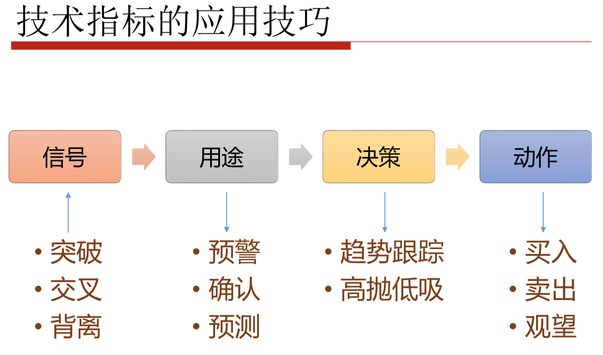

# 量化学习笔记

错误之处，欢迎指出；不同理解，期待交流。

## 第一课

### 1

数据量很小时，单纯的根据数据点去推断、分析、计算数列的数据点，没有意义。

市场是在不断进化，引起全市场投资者的恐慌情绪或者疯狂情绪的大盘点也在不断进化（998——>1849，当年舆论以1000为底，后来如果只是1998，则难以让大多数人认为2000底已破。同理最高点要超过6000，更高点要不止5124），当然这样的分析也可能是错的，只是增加一种理解问题的方式。


### 2

阅读经典书籍，一方面是让自己提高，另一方面是知道大多数人学习参考的书籍，才能明白别人相信什么、可能采取了什么，然后自己才能有更有效的反制措施。


## 第二课

### 3

量化投资选择投资标的时，要考虑流动性、数据、系统化方法。

**流动性**

与交易成本有关，比如市场冲击、滑点。如果流动性不好，那么交易成本是不可预测的。

从策略研究转移到实盘的时候，不可避免地有这个问题

**数据**

数据足够容易获取

**系统化方法**

可以采用系统化的研究方法


### 4

Q：分时图中的**价格曲线**、**成交量曲线**有多少个独立数据点（一天）？

A：价格曲线：241+10，因为除了开盘，还有集合竞价阶段。

成交量曲线：


Q：根据一张分时图的数据，能不能画出当天的日K线蜡烛？

A：不能，因为分时图是采样取点，反映每一分钟的最新价格数据，每个数据点之间间隔的一分钟内，有很多数据没有被反映，而这些数据可能存在真正的最高价和最低价。


Q：一分钟K线数据，可以累计出5、15、30、60、120分钟K线数据、日K线数据吗？

A：可以。


Q：15分钟K线数据能累计处40分钟K线数据吗？

A：不能，因为数据点事对不齐的。


### 5

现在的交易所走的是互联网，以前是走卫星链路。


### 6

交易所给的是快照数据(level 2)，每隔几秒推送一次，间隔期间的数据会损失。


### 7

不同交易软件的，对时间戳的规则约定不一样。

比如东方财富和通达信对于分钟数据，一个是9点30分开始，一个9点31分开始。也就是说，头一分钟的数据，一个是选择整体往前靠，一个选择整体往后靠。

> ```
> 不同的交易软件处理后的分钟数据
>      不完全一致?
> ```
>
> **明确一个行情数据接收和处理的概念** ，为今后搭建量化系统和进行策略开发打下基础 


### 8


### 9

计算技术指标，以"移动平均线"为例

如果单纯根据公式，通过滑动窗口来计算，会有很多重复的计算过程，比如计算前10个数据的总和后，第2个到第10个数据的总和是可以直接用于第2个到第11个数据的总和的。

好在平常使用的pandas、talib库的API在底层已经进行了算法优化。涉及到底层的话，就像互联网面试常考的算法题，是实际工作中确实会存在的问题，只不过站在了前任的肩膀上省去了功夫。


### 10



价格突破/指标突破

均线交叉/其他指标交叉

顶背离/底背离

延迟vs预警vs确认


### 11

量化是赢在细节。其中任何一个环节的错误，到后期造成的错误会被很多倍的放大，推倒重来或者修补错误会耗费极大的时间和精力成本。

如果写一个简单的策略，同时需要问自己很多问题，比如：


