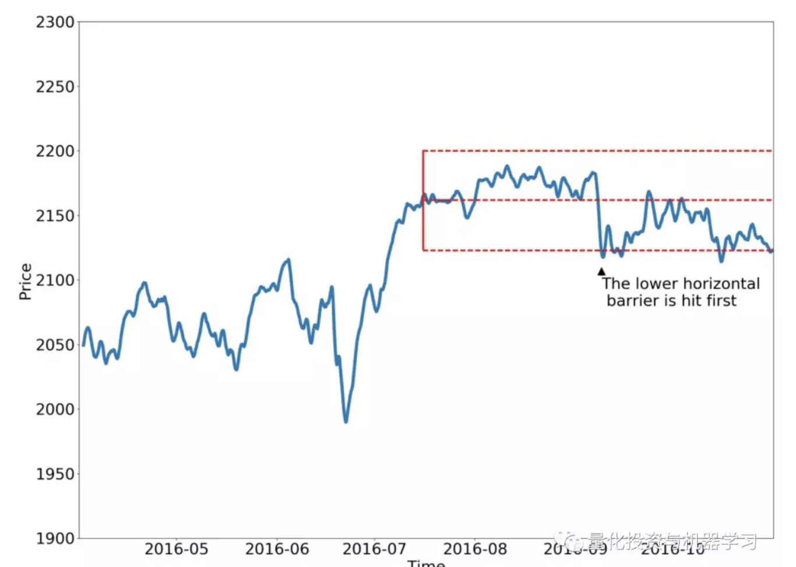

# 人工智能『AI』应用算法交易，7个必踩的坑

> 来源：量化投资与机器学习


## Bars data == weak data

大多数人在一段时间内使用HOLC（高、开、低、收）价格和交易量。这些信息不足以反映出市场的有关信息和交易者的行为。我们需要从订单中获取更直接的价格bids和asks，它将给我们最“原始”的信息。


## 专注于单一资产

我们之前的研究大多都集中在选取某一单一资产，在某一固定时间内对其进行预测，并对多空股票策略进行回测。也许一些口袋里揣着1万美元的散户可以这么做——他们针对某些标的建立基于指标的策略，并进行交易。但如果我们仔细考虑一下，它看起来很像对这种特定资产的过度拟合！对于单个时间序列来说，拥有一个过度适合的策略有什么意义（我们甚至不确定它在过去是否会有同样的效果）。对冲基金从不这么做。他们确实在所谓的资产范围内进行交易（可能采用相同的策略）。投资组合做多或做空这些资产使其保持平衡，或者如果使用某种策略进行交易，那么预期所有这些资产都将有良好的表现。


此外，当你将策略性能与某个基准进行比较时（例如，在Crypto交易中，此基准可以是HODL策略），你感兴趣的是计算Alpha（优于基准的部分）和beta（策略风险敞口）。


## 固定预测界限

当我们准备一个数据集来训练一个模型时，每一对{x_i, y_i}都是在历史窗口中的最后一个日期之后的N段时间内价格变化（或价格移动方向）的窗口。让我们再想想。一段时间后。固定的时间。在金融领域，“固定”这个词很是荒谬的。我们甚至不能确定在一段时间内会有出价或要求执行交易!这是一个非常严重的问题，它实际上破坏了我们所有的预测框架。但我们还没有找到一个简单的方法来解决这个问题。目前只有两种，但它们都是极端的。第一个解决方案是停止预测，开始执行交易，这将使我们立即控制理论和强化学习。它将帮助我们处理任何固定的时间范围（至少在某种程度上），但它现在有点偏离主题。我在下面这书中找到的第二个方案，非常有趣：

**Advances in Financial Machine Learning**




***图片论文地址：***

***http://www.smallake.kr/wp-content/uploads/2018/07/SSRN-id3104816.pdf***


在上面的图片中，你可以看到数据集标签的“非固定时间”创建。它被称为“三重障碍”，其工作原理如下：我们建立三个障碍——一个在顶部，这意味着将利润，底部作为止损，最后一个，垂直的，将意味着某种有效期限。这种标记方法允许基于预测构建更加灵活和现实的策略。


## 独立同分布（I.I.D.）

如果你之前读过一些统计学或ML理论的文章，你会看到这三个字母i.i.d。表示独立同分布，用于描述一些随机变量。对于大多数ML在CV、NLP、推荐系统中的应用，甚至一些时间序列分析和信号处理中都是如此……**但是对于金融时间序列就不是这样的**！看看我们是如何准备数据的:

```
for i in range(N):
   x_i = features[i:i+WINDOW]
   y_i = (close[i+WINDOW] - open[i+WINDOW]) / open[i+WINDOW]
```

当我们在i上迭代时，我们在一个时间序列上滚动某个步骤并且它会发生，不同的目标ys实际上不是独立的！对应的xs具有相同的特性，内部返回相同，只是位置不同。它实际上违反了我们所有的ML框架。解决方案是相当困难的，而我们自己尝试过的方法也是无效的——在使用分钟bar时，只采用了不重叠的窗口，这些数据是足够的。但如果你处理更大的时间表时，这样做肯定是不够的 。 


## 验证集实用性

当我们讨论用Keras进行神经网络训练时，我们通常传递给fit()函数诸如X_train, Y_train, X_test, Y_test, X_val, Y_val这样的数据样本。（蓝色时间序列部分为训练，橙色为验证，绿色为测试）


这些分割代表了一种情况，当我们每N天重新训练一个网络（例如N = 21），验证未来3-7天的性能，如果它满足运行在样本交易周期之外。看起来合理，如果训练，验证和测试集是相似的：例如上面第一张图片有相同的趋势和或多或少相同的波动率，所以神经网络训练向上趋势，在相同的趋势验证并测试同样的趋势会显示出良好的效果。但再过一个月会发生什么呢？情况可能会急剧变化，市场行为可能完全不同，我们的假设将完全错误！解决办法是什么？**首先，变量的分析和选择，不会随着时间而改变。这些特征的一个例子可以是基本数据或一些bar的模式。第二，使用交叉验证、前向测试和模型集成等。**


## 回测过拟合

对策略进行回测，该策略应该让你直观了解它将来的表现。我的意思是，你相信，如果策略在过去的数据上表现良好，那么它在未来或多或少都会带来相同的利润。这根本不是真的。


1、基于5分钟的开、高、低、收、成交量和一些非常简单的特征的QDA，预测下一分钟的变化（二元分类）。

2、训练和val测试21 / 30天和7 / 14天（优化）。

3、用简单的多空股票策略进行回测（周调仓）。


它们几乎每周都超过基准。你能相信这些回测结果的真实性吗？

更多过拟合问题，请查看公众号往期推文（点击标题阅读）：

[**美丽的回测——教你定量计算过拟合概率**](https://mp.weixin.qq.com/s?__biz=MzAxNTc0Mjg0Mg==&mid=2653289314&idx=1&sn=87c5a12b23a875966db7be50d11f09cd&chksm=802e3977b759b061675d1988168c1fec06c602e8583fbcc9b76f87008e0c10b702acc85467a0&token=728085508&lang=zh_CN&scene=21#wechat_redirect)


## 好的预测 =! 好的交易

让我们再讨论一下上面的回测。我们能从策略那里更多的了解什么？例如，让我们检查策略是否真的与ML算法的准确性相关联？


在上图中，有三条权益曲线和相关的F1分数。 首先，我们在图表中看到基准优于我们的策略，F1得分分别为0.68和0.62，在相反的情况下，F1得分数略低于55%。后面你还会发现F1得分最高的股票是55%左右。更准确地说，夏普比率改善与F1得分的相关系数为-0.425。我们能得出什么结论？如果实验设置错误，数据真的是随机的，没有准备好，那么其他的一切也是随机的。**垃圾进垃圾出。**


## 结论

**机器学习应用量化金融是不同的，也是困难的**。我们确信在这个过程中仍然遗漏了很多，我们使用的资源并不能涵盖所有的问题，但是我们可以看到，仅仅使用Keras神经网络是远远不够的。这是一个很好的开始，可以避免过度拟合，也可以很好的证明你的数据，你的特征和你的算法有一些一般的预测价值，**但它不会让你赚钱。我们有99.99%的把握，把剩下的0.01%留给运气**。但我们不认为对冲基金经理会投资于这个Alpha。


祝你好运，最后补充一句：不要放弃！这篇文章虽然告诉大家ML可能在量化金融领域并不是那么一帆风顺，但实际上它与机器学习应用的其他领域并没有太大的不同。无论如何，你要全面的研究整个市场，正确的建模。量化金融也是一样——我们只需要更细致地研究市场，建立模型。

