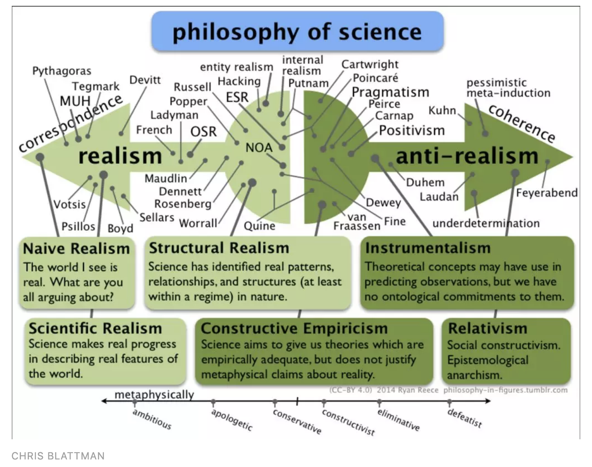
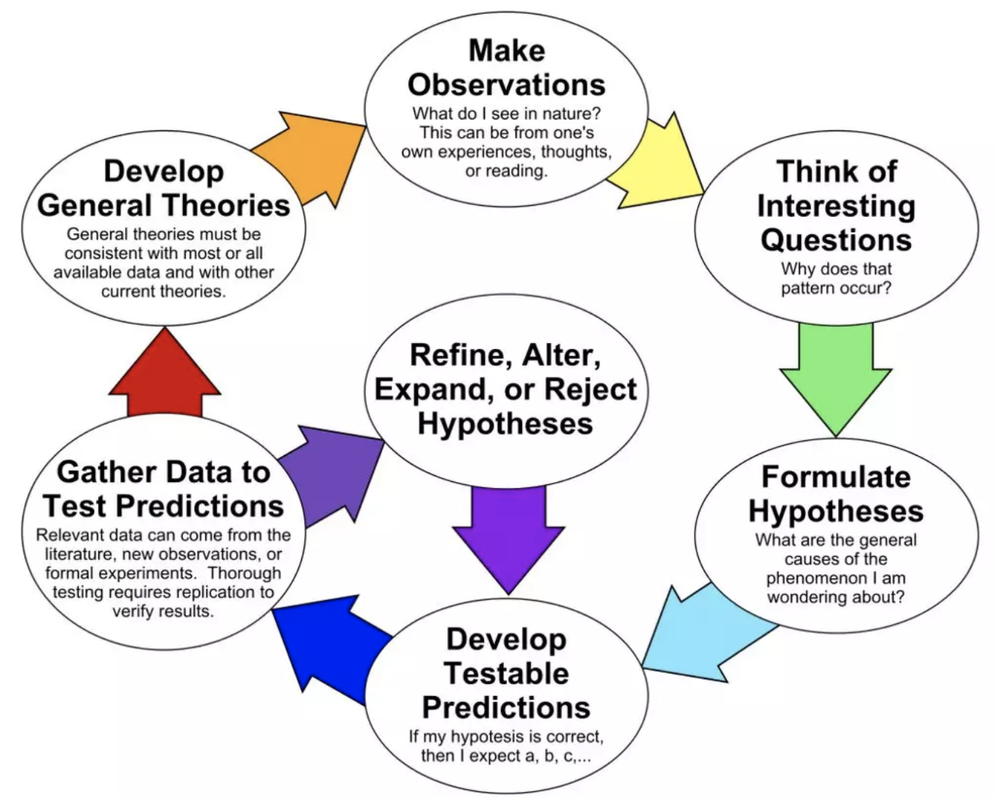

# 如何成为一名Quant

> 来源：挖地兔

量化金融应该被视作为一门科学而不是一门专业。这就意味着知道如何成为一名Quant比变成一名Quant更重要。前者涉及量化金融的**原则和意识**（我相信这些东西可以成功的应用到金融或技术的任何领域），而后者涉及为了获得“量化”的工作所需要的实际活动。

在一个基本层面上，作为Quant不仅仅知道在给定一些随机模式的情况下如何推导闭合形式公式估计外来期权的价值，也不仅仅是知道如何开发、训练和测试使用统计回归模型的系统化交易策略。作为Quant就是相信并将科学方法应用到一般的金融市场的研究中。

这种意识在衍生品（量化分析师）的估值中受到欢迎，但很快蔓延到风险管理（量化风险分析师），资产管理和交易（强化交易和策略师）。我预计，在未来几十年，这种意识将继续扩展到企业金融，投资银行，私募股权，甚至风险投资领域。**在每个领域，它可能采取不同的形式，稍微演变，甚至可能采取新的名称（数据科学？），但是这种意识将保持不变。**

**一、科学哲学**

**二、科学方法**

**三、思考模型**

**四、结论和总结**

## 一、科学哲学

如何成为Quant～了解经验科学和归纳推理的局限性。明白所有金融理论是易出错的，所有的量化模型都是脆弱的。

Mario Bunge的著作《科学哲学：从问题到理论和科学哲学》，《从解释到理由》。学习科学哲学，并且发现模块中许多思想对作为Quant十分有用。

科学哲学是哲学的一个分支，它涉及科学的逻辑基础，方法和含义。从广义上讲，它试图回答这些问题：“什么是科学？”，“为什么科学有效”，“科学的局限性是什么？”。随着时间的推移，形成了不同的，有时相互矛盾的科学哲学。这些包括但不限与科学现实主义、建设性经验主义与工具主义，归纳、演绎与推理，甚至逻辑实证主义与可证伪性。

有关这些哲学相对于彼此的有趣图表如下：

### 现实主义 VS. 经验主义

现实主义认为，科学描述的世界是现实世界，而不是现实世界所认为的世界。另一方面，经验主义认为，因为知识是基于经验的，所有知识都是试探性和概率性的，因此需要进行修改和证伪。确实存在各种形式的现实主义和经验主义，它们的严格程度不同。e.g. 科学 vs.结构现实主义。

支持现实主义而不是经验主义的主要论点是科学理论的准确性。换句话说，如果理论是准确的，意味着它可以用来预测现实世界中发生的事情，那么它必须描述现实世界。虽然这在物理学中可能基本上是正确的，但鉴于金融理论的不足，我认为我们应该认识到金融理论本质上是试探性的，并且需要进行改进和证伪。

### 演绎、归纳与推理

科学哲学区分了集中不同形式的逻辑推理。

**演绎推理(演绎)**涉及从一个或多个逻辑前提推理以达到某个逻辑结论。演绎推理是在数学和计算机科学的形式方法中找到的推理形式，它将合理的前提与必然是真实的结论联系起来。

**诱导推理(诱导)**是一种稍微弱一点的演绎推理形式，它认为通过演绎推理得出的结论可能不是必然的，但鉴于现有的数据和前提，它们总是最好的结论。

**归纳推理(归纳)**涉及从一个或多个强有力的前提进行推理，这些前提基于证据和观察，得出的结论在给定支持证据的情况下是概率上真实的。归纳推理永远不会被证明是正确的，只有在观察到相互矛盾的证据时才会被证伪。

归纳推理的缺陷是通过归纳获得的知识是脆弱的。这是黑天鹅的故事的缩影。如果到目前为止观察到的每只天鹅都是白色的，我们可以用这个证据来推断“所有天鹅都必须是白色的”; 然而，只需要观察一只黑天鹅来伪造理论。因此，据说通过归纳原因获得的知识是脆弱的。这是Nassim Taleb研究的前提。

**关于市场的量化理论建立在经验观察的归纳推理之上。因此，这些理论通常是脆弱的，并且在存在相互矛盾的证据（模型未预测的异常值和黑天鹅）的情况下可能无效或伪造**。然而，这在理论上是正确的，并且在实践中，大多数理论都是虔诚的，而且相互矛盾的证据往往被忽略。

**您可能想知道科学哲学如何帮助您成为Quant？我认为它很重要，因为它迫使我们认识到我们的局限性，它使我们保持客观，但最重要的是它提醒我们，即使一些金融理论根深蒂固到我们的专业中，它们对于反驳它们的实证结果似乎是绝对可靠的，他们不是完全正确的。**在做出这一陈述之后，我们会想到一些经济模型和流行的量化模型假设，即无抛补利率平价（UIP），正态分布的回报，线性和平稳性，以及随机游走假设/有效市场假设。

## 二、科学方法

如何成为一名Quant～使用科学方法。它有助于指导科学思考，并将改善模型的整体可测性及其假设（假设）。

科学方法被定义为一个持续的过程，通常涉及系统观察，定量测量，实验，假设公式，假设检验和假设改进。在本节中，我们将针对**随机游走假设**进行此过程。

这是一个非常有用的幻灯片【1】，解释了科学方法。它也是下图的来源。

### 进行观察

观察通常是我们看到的事情，但是在金融市场的背景下，观察可以扩展到我们在书籍，电视上或者甚至在阅读好（或坏）博客时遇到的想法。按照我们的例子，我们可能会观察到许多学术论文和流行书籍已经发表，其中表明市场回报是根据随机游走/随机过程演变而来的。

### 提出有趣的问题

提出有趣的问题几乎总是有点怀疑。首先提出最简单的问题：谁？什么？哪里？什么时候？为什么？以及如何？只是问这些问题可以发现进一步研究的有趣途径。让我们问一下随机游走假设的这些问题：

1、就市场而言，这适用于谁？所有市场都是随机的吗？流动性和其他相对效率指标如何与市场随机性的衡量相关联？

2、使市场随机化的潜在力量是什么？效率是否真的导致随机性？如果市场是随机的，那么代理商就没有动力在市场中竞争，那么市场是否会停止高效，这意味着它不是随机的？

3、市场在哪里随机？这与问题1有关。世界上是否存在市场不那么随机的地方，例如发展中市场？如果是这样，为什么？动力学不同吗？

4、市场何时随机？市场总是随机的，或者在某些非随机制度中这种随机性是否会中断？如果市场并非总是随机的，这是否意味着存在盈利机会？

5、为什么市场是随机的？这与问题2有关。保持市场随机性的市场力量是什么？假设主要驱动因素是市场效率那么......

6、我们如何衡量效率并测试随机游走假设？我们能否使用基于代理的模型模拟有效的经济，并测试价格发现机制是否随机？

正如您所看到的，具有讽刺意味的是，这个过程非常随机，**许多问题可能已由先前的研究人员全部或部分回答。这就是进行文献综述很重要的原因。一旦你提出了足够多的问题并阅读了关于该主题的现有文献，一些“好主意”就会开始形成。**这些是我们想要形成可测试的科学假设的想法。

### 形成假设

**假设是声明性陈述，它断言一组变量之间的特定关系**。**好的假设应该简洁，陈述，易于检验，并考虑到以前的科学研究（以避免无聊的追求）**。举例来说，以下有趣的想法，实际上是由一位非常热情的读者在我以前的博客文章中提出的：

“**市场回报表现出随机性，因为市场迅速适应以消除任何弱点。**”

尽管这**是一个好主意，但它会产生一个可怕的假设**。它留下了**许多未定义的术语**，不**是很容易测试或反驳，实际上是一堆拼凑在一起的假设。**

让我们尝试从中做出一些假设：

**【假设1**】市场运动（向上或向下）与二元Martin Lof随机序列无法区分。 

当然，这是我之前的文章Hacking the Random Walk Hypothesis背后的假设。与大多数研究一样，我的研究得出了一个脆弱的结论，即“市场不是随机的，至少根据上述定义”，以及更多的问题。这些问题通常会带来更多假设和更多研究。正如您所看到的，研究，特别是使用科学方法完成的研究，是一个永远不会真正停止的持续过程。让我们将这个假设分解为两个部分：

**【假设2】** 市场效率，及时访问所有信息，需要市场随机发展。

我们将在下一节讨论如何测试这个假设。但是，我想请你注意LeRoy在1973年写的两篇论文，风险规避和股票价格的鞅属性，以及卢卡斯在1978年写的交换经济中的资产价格。这些文件旨在测试在交易经济中行事的理性代理人是否能够及时获得所有相关信息，这使得股票价格随机变动。他们的结论是，虽然有可能构建一个随机行走的市场，但也有可能不能。因此，效率并不一定意味着市场必须是随机的。

“关于股票价格的随机性，显而易见的是，人们可以构建严格的经济模型，其中价格序列具有这种特征，而且具有同样理性和知情的代理商，而这些特征是他们没有的。这表明结果 关于实际价格系列是否具有鞅属性的测试本身并未阐明市场“效率”这一普遍提出的问题。" ——Lucas

最后，我们可以将这种说法分解为第三种假设，尽管最有趣，但却是研究最少的假设。这主要是**由于可以被测试的难度。**

**【假设3】**无论市场是否随机演变，所有有利可图的机会都挤得过快，投资者随着时间的推移会产生一致的α。......嗯，这是一个多么有趣的想法。

如果我们将上述假设约束到特定的时间范围，例如：5年，定义alpha也许我们可以测试这个假设。话虽如此，这个假设肯定比其他假设更简洁，更具说服力，并且更难以反驳，即它不是一个很好的假设，可以被打破。

### 制定可测的预测

通过假设您的假说是真或假来开始预测。现在计算出您期望或不期望存在的数量。例如，如果我提出的第一个假设是正确的，那么我们可以预期市场收益（上升或下降）在NIST加密测试套件中也会像已知行为被称为二元Martin Lof序列的序列一样。在我之前的文章中，我使用Mersenne Twister RNG进行比较，并证明这不是真的。反过来，这暗示假设是错误的。

许多人陷入的一个错误是，他们认为他们错误地认为做研究的目标是正确的。实际上，假设是真是假并不重要，重要的是我们为特定问题的现有科学知识体系提供了新颖的信息。

如果我要测试第二个假设，我可能会更进一步，开发一个可以保证效率的基于模型的算法【2】。从这个模型中我将提取返回序列，并再次测试它们以查看它们是否是随机的。我们将在本文中进一步讨论模型的思考。

### 收集数据以测试预测

这是自我解释的。我想补充的唯一一点是，用于测试预测的数据**既可以从现实世界中收集（**经验），也可以使用**与假设相匹配的模型进行模拟**。这两种方法**都有利有弊**。经验数据受到衡量，收集和维护的偏差; 模拟数据是假设模型正确实现。

### 重新定义，改变或拒绝假设

根据收集的数据，我们可以说“是的，我们的预测是正确的，这个证据支持假设”或“不，我们的预测是错误的，假设是错误的”。请注意，在第一个结果中，证据仅支持该假设，而在第二个结果中，证据伪造了该假设。这又回到了科学哲学。**假设（或理论）可能是伪造的，但它无法证明。**

### 发展一般理论

一旦开发出足够数量的假设并进行严格测试，它们就可以合并为更一般的理论。例如，在现代投资组合理论被普遍接受之前，它需要对风险与收益之间的关系进行数十年的科学研究。事实上，在出版他的博士研究时，Markowitz的投资组合理论几乎被拒绝了：

“当我作为芝加哥大学经济系的学生为自己的论文进行答辩时，米尔顿弗里德曼教授认为投资组合理论不是经济学，他们不会授予我要拿经济学博士学位，因为这篇论文与经济学无关。我认为他只有一半话是认真的，因为他们确实授予我博士学位，而我没有长时间答辩。关于他论点的优点，在我为我的博士论文答辩的时候，投资组合理论不是经济学的一部分，在这一点上我非常愿意承认。但是现在它是经济学的一部分” ——Markowitz

我想我们都可以从这个故事中学到一些东西。**仅仅因为你的想法不受欢迎，或者没有被广泛接受，并不一定意味着你错了**。在我看来，**金融界非常过时，喜欢坚持几乎具有宗教信仰的某些理想**。Quant的作用是客观地看待金融世界，慢慢发现金融市场的真相。**寻求真相不是共识**。

我必须将LeRoy和Lucas的Markowitz引用和关于论文的知识归功于Andrew Lo和Craig MacKinlay所著的A Non Random Walk down Wall Street一书。

## 三、思考模型

如何成为Quant〜将您的想法形式化为模型。然后使用这些模型进行更清晰的思考，测试您的想法的有效性，并识别隐藏的模式。

本文的最后一部分涉及思考模型。**模型是现实世界中某个对象或过程的表示**。**Quant建立模型所使用的工具是数学和计算机科学**。例如，Quant可能维护与特定资产组合相关的风险模型。但为什么首先使用模型呢？特别的是，他们是2008年金融危机的最大贡献者之一。

### 模型帮我们更清楚地思考

把想法发展成一个合适的模型，无论是代码，数学还是两者，都迫使我们非常清楚地定义这个想法。模型迫使我们在输入，处理和输出方面考虑理想。这个过程本身有助于我们识别缺失的组件并纠正损坏的组件。

### 模型是可测的、直觉不可测

一旦一个想法被编纂为模型，它就是可测的。**对每个模型的最终测试是看它与现实世界的叠加程度**。以资产的几何布朗运动随机模型为例。模型与现实世界相比如何？是否有市场崩溃？它是否有更高和更低波动的时期？答案当然不是没有。**这些差异促使我们开发出更复杂的随机模型，如默顿跳跃扩散模型和赫斯顿随机波动模型**。

模型的**另一个更常见的测试**是看它**是否在过去有效，即它是否适合数据**。以一个简单的价值偏见的投资策略为例。**只要该策略基于基金经理的直觉（自由裁量权），您就无法对其进行回测**，以确定它是否会在过去产生更高的回报。你所能做的就是希望基金经理和他说的一样好。对于那些有趣的人来说，两个极棒的Quant博客经常争论基于模型的交易的优点是Alpha Architect和Flirting with Models。

### 模型帮助我们解决隐藏的模式

永远不要忘记使用神经网络等机器学习模型【3】进行模式识别的所有惊人发展; **即使失效的简单模型也可以帮助我们发现隐藏的模式和洞察我们的世界。**

例如，以下一个简单的问题：为了使一个城市的种族隔离达到80％，有多少人需要种族主义？结果可能会让你感到惊讶，因为事实证明，如果30％的个人是种族主义者，那么在城市或城镇就会出现种族隔离。这就是一个简单模型的魅力，例如谢林隔离模型; 他们**可以帮助我们获得我们在没有模型的情况下永远不会有的见解**。请查看以下视频，了解谢林模型的解释，如果您喜欢，请注册Coursera上的Model Thinking。这是一个很棒的课程；我也需要抽出时间来完成它。

最后，我要说**数学和计算模型的最大好处是它们允许我们摆脱头脑中不精确的心理模型**，并且这样做**可以显著降低个体的认知负担。基本上我想说它们让我们更聪明。**

## 四、结论和总结

量化金融是一种意识形态，Quant不仅仅是擅长数学和知道如何编码；它是关于相信并应用科学方法来研究金融市场。

鉴于这种信念，我对希望成为Quant的个人的建议很简单：无论你是否拥有头衔，都要成为一个Quant。坦率地说，我想不出为什么量化金融的基本原则和方法不能成功地应用于其他非量化金融服务领域甚至非金融服务公司的原因。在我看来，这是量化金融的下一个合乎逻辑的步骤，从现在开始的几十年，我认为量化风险资本主义和量化投资银行业将风靡一时。

最后我要说的是，即使你只学会了一种转变思维的方式，或者说能在面试中运用这些原则，你也能出类拔萃。