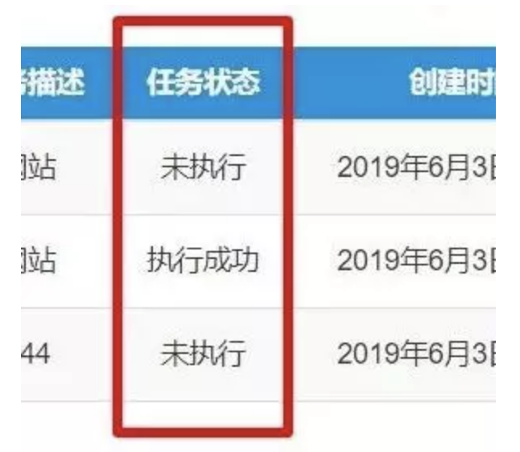
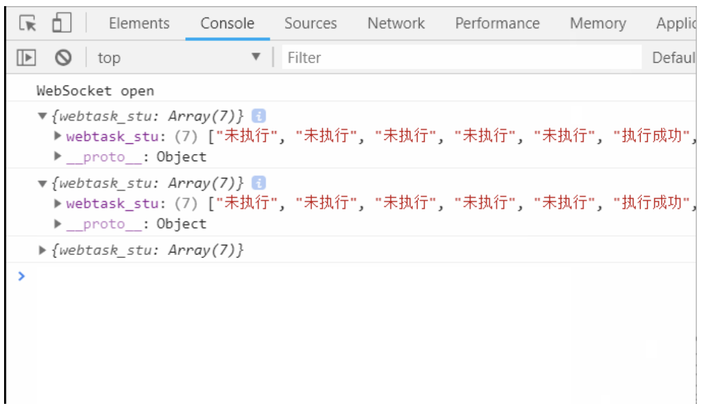

# 网页数据实时刷新实现

后端框架是Django，具体业务逻辑是否合理可以不用管，下方是工作中需要实现的需求

自动化程序脚本运行的三种任务状态：

1、未执行  2、执行成功  3、执行失败  

任务状态在网页前端实时展示，需要每隔一段时间请求数据库中的状态数据字段为webtask_stu，并返回前端展示



## 两种思路：

### 1、前端轮询，每请求一次，建立一次连接，后端返回前端数据一次

具体实现：设置定时器，每隔5s请求后端数据，后端返回数据后渲染前端


### 2、前端请求只建立一次连接，后端能持续主动向前端推送数据

具体实现：前端通过socket方式向后端建立连接，后端定时查询数据库数据，主动向前端推送，这种优点很明显，可以减少网络请求次数


### 方式一：Ajax定时请求：

1、前端设置定时器setInterval,定时器里面传ajax请求函数和时间

```javascript
function get_stu_list(){
 param = {};
 $.post("/web/webtask_stu/",param,function(data){
   var webtask_tu_list = data.webtask_stu;
   console.log(webtask_tu_list);
   var tr = $("tbody tr");
   $.each(tr,function (i,ele) {
      $(ele).find("td:eq(4)").text(webtask_tu_list[i])
   });
  });
};
setInterval(get_stu_list,5000);
```


后端也很简单，查询数据以JSonResponse返回即可

```python
@csrf_exempt
def webtask_stu(request):
  webtasks = Webtask.objects.all()
  webtask_stu_list = []
  for webtask in webtasks:
    webtask_stu_list.append(webtask.webtask_stu)
    dit = {'webtask_stu': webtask_stu_list}
    print(webtask_stu_list)
  return JsonResponse(dit)
```


### 方式二、websocket

效果图如下，后端持续向前端推送数据，前端控制台输出演示



1、前端部分构造socket连接对象，协议就是websocket协议了，不是http协议，所以前面用ws开头

2、windows.loaction.host可以获取域名(包括端口)

3、主要用到的方法如下，具体也可以看注释

socket.onopen ： 成功连接

socket.onmessage ： 成功获取后端返回的数据，通过jquery渲染后端返回的状态数据实现刷新效果

socket.onclose：连接失效

4、后端返回来是字符串，需要用到JSON.parse转成前端对象

```javascript
var socket = new WebSocket("ws:" + window.location.host + "/web/webtask_stu/");
socket.onopen = function () {
   console.log('WebSocket open');//成功连接上Websocket
    socket.send('adasdasda。。。。');//发送数据到服务端
};
socket.onmessage = function (e) {
   // console.log('message: ' + e.data);//打印服务端返回的数据
    // console.log(typeof (e.data));
    console.log(JSON.parse(e.data));
    // console.log(typeof (JSON.parse(e.data)));
    var webtask_stu_list = JSON.parse(e.data);
    var tr = $("tbody tr");
    $.each(tr,function (i,ele) {
      $(ele).find("td:eq(4)").text(webtask_stu_list["webtask_stu"][i])
    });
};
socket.onclose=function(e){
 console.log(e);
 socket.close(); //关闭TCP连接
};
```


后端Django部分：

1、django项目的话安装dwebsocket，pip install dwebsocket ，并在代码中导入

```
from dwebsocket.decorators import accept_websocket
```

2、加装饰器@accept_websocket，接收socket请求

3、if request.is_websocket，判断是否是websocket请求是的话执行我们后端的从数据库查询数据的功能

4、通过time.sleep和while循环实现每隔5秒向前端发送数据

4、request.websocket.send(json数据)返回数据到前端，因为这里是json数据格式，所以前端上面要用JSON.parse转对象，

```python
@accept_websocket
def webtask_stu(request):
   if request.is_websocket():
     while 1:
      webtasks = Webtask.objects.all()
       webtask_stu_list = []
       for webtask in webtasks:
         webtask_stu_list.append(webtask.webtask_stu)
         dit = {'webtask_stu': webtask_stu_list}
       time.sleep(5)
      request.websocket.send(json.dumps(dit))
```


两种思路大致如上，实现socket还有其他更高级的api，可以自行搜索学习。