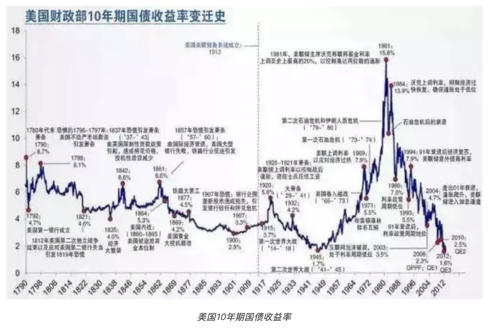
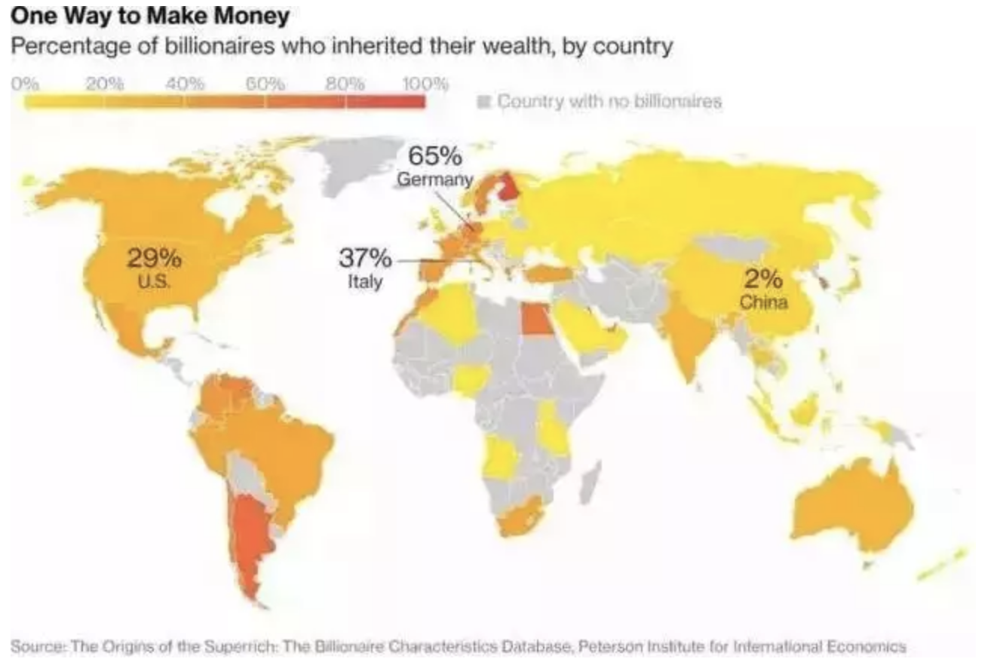

## 真正能改变命运的窗口，都在社会巨大变革的风口上

> 来源一个随时可能被封的公众号
>
> 句句揭露现实，甚至有些残酷


曾经我有幸拜访了韭菜收割界金沙赌场（NYSE：LVS）的大佬，谈到韭菜赌徒的命运，大佬反问了一个问题，**『你听过最大的谎言是什么？』**，笔者失语，大佬给的答案是：是**『世界充满爱』。**


没有无缘无故的爱，没有无缘无故的恨。真正的情感联系都存在于**致胜联盟**的成员之间。**一旦突破圈子，跨越阶层，是不会有情感的，最多是怜悯。**只是左派们总有天下大同的愿景，用大爱掩盖大恶，**通过掩盖残酷的真实来麻痹被收割阶层**。有的时候，残酷才是真爱。 


正如人类不太在意屠宰场里的惨叫，同样，将军也不会记得阵地上的炮灰是什么名字。**作为历史进程中的一份子，人生最重要的任务是『追随历史运行的方向』，不要莫名其妙被历史碾死。**


我们一定要牢记，对于爬到食物链顶端的人来说，没有仁慈可言，规矩只有一条：**Hunt or be hunted（收割或者被收割）。**


随着社会的进步，物种越来越少，人种越来越多，社会与市场赋予了我们的不同的角色，有的是兔子，有的是狼。对于兔子而言，**焦虑不会提升存活几率，不断思考，提升认知水平才是出路。** 


**太多的绝顶聪明的狼，利用你认知和人心里面最常见的缺陷，完成了很多次猎杀。**


### 1. 认知时滞：无知+懒惰

> **致命时滞是阻碍阶级爬升的最大的陷阱，是高等认知阶层对低等认知阶层的全面收割。**大多数人民群众依赖过去经验，不断地与政策和经济周期对抗，自杀式的去逆天而动，**这样的情况往往存在于大周期的末端。** 


很少有人想到，**集邮收了他这一辈子最贵的智商税；**也很少有人想到，邮票会成为债券和股票之外最大的赌场。这得是收割者的高明布局，也是被收割者懒于进化的完美配合。


在一个大家Email都有点懒得发的年代，邮票本来已经失去使用价值了，之所以还有机会，**主要是喜爱集邮的用户群中退休前后达到存量财富高峰。** 

恰好，喜欢邮票的用户是天然经过筛选的，是天选之韭菜：

- **第一，年老**：喜爱集邮的多数都上年纪了，有一点钱和贪婪；
- **第二，落后：**认知落后，这个年头还在集邮，多有执念，生活习惯早已定型；
- **第三，封闭：**生活圈子也不丰富，三线城市小圈子内相互强化安利效果。

因此，用户在参与邮票的第一刻，就输在起跑线上。 邮票本身的刚需结束了，更可怕的是，**邮票本身不稀缺，从供给角度看，理论上是无限的，边际成本为0**。

80版本的猴票，小小方方一片纸，**2万元一枚卖给你算人情价，一整版150万。**同时，这样的交易品类有数千种，价格不等，将纸卖出房本价格，操盘小马仔奖金发到1000万是历史性的高峰，是老板收入的1% 。


邮币卡只是韭菜收割机里面的小型款，更大的，还得算房地产和美元。


**去年，三四线接过一二线的交接棒，**房价还在暴涨，货币还在贬值，浓重的焦虑缠绕着几乎所有漏网的中低产阶级。


**下半年：**『绝不下跌的』房价逐步回落，中产们因为焦虑而匆忙买入的商品房开始褪色。TMD，**似乎上当了，刚刚加满了杠杆，套进去了几乎所有的现金流，这回如果有风吹草动，可是真要坐以待毙了。** 


不仅如此，几乎同一时间，金融业的基本面都在变化，**隔壁老王的孩子海外名校金融硕士回来，居然失业了，国内火热的金融业居然开始去产能了，那些高大上的机构，给的offer起薪比隔壁码农的还低，裁员裁得稀里哗啦。**


这种N年辛苦投入，最终发现下错注的感觉，非常不好，简直就是**『受尽折磨几十年，一朝叛变解放前』，糟糕极了**。其实，这不是老王的错，而是老王的命运，多数人疏于提升认知，不看周期，只知道copy别人的成功经验，在周期末端下注，搞错方向屡见不鲜。


让大家如同飞蛾扑火的习惯，还有懒惰，美其名曰『安全感』和『经验』。


大多数人都是根据过去的经验判断未来，但是时代在变，**大家认为，刻舟求剑的行为能带来『安全感』，但是，正是这样的『安全感』带给我们最大的陷阱，给我们最大的红海。**金融好，就一窝蜂上！IT 好，就一窝蜂上！学钢琴好，一窝蜂上，哪管最后是不是街头卖唱。


过去，社会发展速度慢，错误的选择反馈也慢，少数成功的选择被反复传颂，过度放大。**社会变化一旦加速，巨大的惯性酿成了诸多惨案。**



看看上图的美国国债收益率变化，**这是全球利率的重要参照，从1981年起至今，一直处于降息周期。**换句话说，钱这种生产资料，30年来敞开供应，搬运货币的金融业迎来大牛市，承载货币的房地产迎来大牛市。换句话说，看懂了大趋势，时代推着你发财。


此前籍籍无名的『高盛』、『黑石』都在这30年大周期里突飞猛进，从小玩家成为大作手**。而各个国家的房地产被推动到一个历史罕见的高位，突破大多数人的认知极限。**


但是，天下没有不散的宴席。市场上还依然散播着房子永远涨的时候，利率开始了30年的大反转，慢慢开始上行。


利率是货币的价格，货币在长期中只有一个对标：**生产力技术（效率）的高低，从1945年低点到1981年高点，这36年中，生产技术是飞速提升的，利率很高。从1981年高点到2016年低点，35年的降息周期恰好信息革命，加起来60-70年。**其实大致上，就是一次康波周期的时间，一代生产力技术革新的周期。


今天，处在加息周期的开始，新一轮生产力大跃进的开始，**我们最正确的事情是投身到这个最大的科技浪潮中，而最错误的事情恰恰是去继续上一个周期末端的套路：搬运资本和炒作房产。**


可惜，人类的『经验』是相当短视的，我们记得过去5年的变化，10年以上的趋势无人在意，但是，正是这种来自于康波周期的大趋势才是真正的**『不可抗力』。****多想想历史的进程，有没有与周期做朋友。**


**时代就是我们的命运，相信的，被时代牵着走；不相信的，被时代拖着走。**


### 2. 资源错配：胆小+贪婪

> 受益于改革开放，一些人成为了中产，但是性格还停留在农民阶层，**那种胆小怕事的性格只配被收割。**他们放大了自己的努力学习的因素，却忘记了康波周期和政策巨变的巨大推动。**他们忽略的教育的本质是捍卫阶级，而非改变命运，在巨大的资源错配中畏首畏尾，失去未来。** 


**现代教育的起源，是17世纪的德国，其教育是为大机器工业服务的，他们要培养的是整齐划一的人，主要是为培养劳工服务。**中国的教育，则与治理结构有关。当初中国如此低的生产力为何能组织这么大的国家，其主要因素是科举。**科举能控制人的思想，保持价值观一致，不然在北京很难遥控海南的一个县长。**


**现行的教育依然是一种社会工具，向工业体系输出人才，普通人希望教育改变命运，大概率是谬论。**


**而且，从需求端来看，对于教育的要求也发生了根本性的变化，**我们正在处于新一轮科技大爆炸的早期，AI的大趋势才刚刚抬头，智能时代，可以确定不需要太多流水线上的工人和中层白领；**未来教育应该是探索而不是应试。未来教育最重要的是艺术的感觉、科学的思想。**这些，现存教育体系里面，都严重缺乏，但是供给却还是僵化的。


眼下，与此同时，**我们还在积极地通过名校培养大公司职员，培养职业官僚，制造产能过剩，一切都在错配。**更可悲的是，**大量中低产豪赌教育，压上所有的希望和财力，最终，结果可能令人失望。**


随着社会的繁荣稳定，社会阶层一定是走向阶级固化的，这是周期性出现的。


意大利银行两位学者比较了1427年到2011年间佛罗伦萨一些家族的税收记录，**发现最为富裕的佛罗伦萨家族大约在600年前就已经位于高等阶级，**沿袭至今。**文艺复兴时期的18个大家族，除了2个家族移居米兰，其余16个家族的税收今天依然占了佛罗伦萨税收的80%以上。**究其主要原因，**这些家族将佛罗伦萨上的好地盘都买了，由于佛罗伦萨历史悠久，好地段就那么多，家族的财富也就很难流失。**


举两个例子，意大利花思蝶家族（Frescobaldi）和德国富格尔家族（Fugger）。他们都实现了近**700年的财富传承。**

```
花思蝶家族以羊毛贸易起家，1308年以后转向葡萄种植和酿酒，历史上曾供应米开朗基罗和教皇利奥十世葡萄酒，资助英国王室，建造佛罗伦萨第一座桥。700多年过去了，花思蝶家族仍然在经营庞大的葡萄酒事业。

德国Fugger家族曾是16世纪欧洲最富裕的家族，传承至今已经19代人。其后代Babenhausen伯爵视在伦敦投行工作几年后，回到德国经营家族财富和慈善活动。
```

德国经济研究院院长曾经表示，今天，**在德国，社会出身对个人收入的影响比其他任何国家都大**。



*亿万富翁财产来自继承的人数比例，德国最高，达到65%。中国最低，目前仅为2%*


**从历史的证据看，在阶级上升方面，教育的作用是微乎其微的。但是，防止富裕阶层的后代跌落到社会阶级下层，教育是非常重要的。**通过从事特定的高收入职业，捍卫阶级是非常有效果的，例如银行家和律师， 600 年前至今都是高薪职业。


在静态社会中，阶层是固化的，教育改变不了命运，只捍卫阶层。**真正能够改变命运的窗口，都在社会巨大变革的风口上。 在那些风口，需要的是冒险精神和行动力，而不是精致的学历和傲娇的身段。**


王健林说过一句话，『清华北大不如胆子大』，这句话是有良心的。在社会剧烈变化阶段**，最重要的除了读书好，还要到社会变化的风口去抢钱，有胆量去边缘市场发掘机会。**

南都周刊做了一个统计，国内从幼儿园到大学毕业，大概是134万元开支，出国需要262万元。作为顶尖阶层，王健林的儿子王思聪从小在新加坡Swiss Cottage读小学，然后到英国温彻斯特公学读中学，然后在伦敦大学学院读本科，然后回国干私募股权基金。


**教育行业的高度，是被富裕阶层捍卫自己的决心给顶起来的。 国内的诺亚财富（NYSE：NOAH）在投教育，国内最大的地**产商之一碧桂园也投了教育，博实乐教育（NYSE:BEDU）刚刚上市。作为中概教育大牛股，好未来（NYSE:TAL）**大涨的背后折射的是对阶层上保险的保费。**


**今天看，『不能让孩子输在起跑线上』这种想法，拼命投教育，一开始就注定了资源的错配，并可能真正的导致孩子和家庭失去未来。** 


**中下阶级本没有什么可以失去，反而像中上阶级一样矫情，焦虑起跑线的问题，**既无洞察，也无胆量，最终砸锅卖铁参与富裕阶级的教育军备竞赛，然后淘汰出局，收割完毕。别人只是用手机余额给自己的孩子上了一点保险，确保好接班而已。


对于大多数人，应该学习的是田忌赛马，**以有限的资源去成为一名手艺人、艺术家、网红、码农甚至厨师并做到顶级，去获取手艺人的溢价，**而不是和王思聪一样去花几千万去名校学哲学，然后无所事事去干PE。

