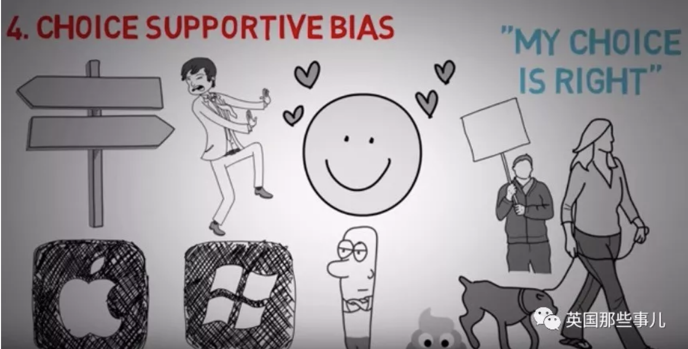
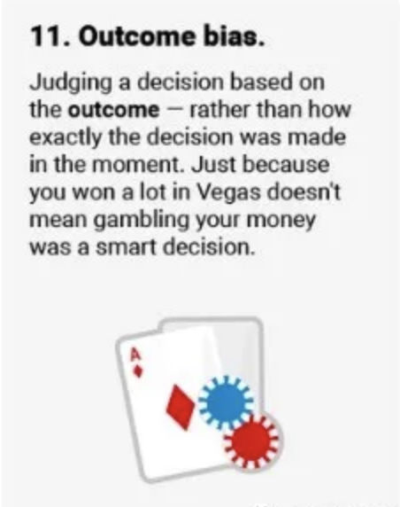

# 20个认知偏差

当我们做决定时，总是会无可避免的受到“认知偏差”的影响。

比如...

## 锚定偏差

人们过度依赖于接收的第一个信息，不管它可不可靠。

举个例子，朋友和你一起吃饭，你想去快餐店，但你朋友想去高档餐厅，最后你妥协了。

进餐厅后，你翻开菜单，“啥？！一块牛排350？！脑子瓦特的人才会点吧？”

然后你继续看了看，发现芝士汉堡只要100。于是你觉得，这还蛮便宜的，就点它了。

如果你去快餐店，看到一个芝士汉堡卖100，你可能也会感觉很贵，但因为你刚才已经锚定了350元的牛排价格，所以这100元的芝士汉堡在这家店就成了便宜，成了你可以接受的合理价格。

同样的状况也发生在工资协商中。

找工作的时候，如果面试官问你目前工资多少。

假设你目前工资是年薪15万。

但是，通过你自身的努力，你的职业技能所值的市场价已经达到20万。

**这时候，你不应该直接回答“我现在年薪15万”**

而是这样回答：“根据目前的市场行情，我的岗位工资应该是20万，我目前的工资是15万。我认为这是肯定有提高空间的。”

你同样回答了问题，但你给了对方不同的数字去锚定。

当然，前提是，你提的数字不要太夸张。

## 可得性偏差

人们很容易被自己看到或听到的东西影响。

有的人可能会认为吸烟对健康无害，因为他认识一个人每天抽一包烟，结果还活到了100岁。

他的信息很有限，却把会它当真理来对待。

同样的事也发生在恐怖袭击上。

很多人可能认为对美国来说，恐怖袭击是最大的威胁，因为电视上每天在报各种恐怖袭击。

然而，根据美国消费品安全委员会的数据，美国人被电视砸死的概率都比被恐袭分子打死的概率高。

而且被警察打死的概率比被恐怖分子打死的概率高130倍。

那为什么人们会认为恐袭是最大的威胁？

因为人们不是依据事实或者统计数据来做决定的，而是根据新闻，或者从其他人口中听来的故事来做决定。

## 从众效应

倾向做很多人做的事或相信很多人相信的事。

比如：选举的时候，不知道选哪个，看那个人票数最多就投他吧。

开会的时候也是一样，如果10个人里面有9个意见一致，那唯一一个意见不同的，很可能会选择从众。

## 支持选择偏误

人们如果一旦作出了某个选择，就算这个选择有些瑕疵，你也会倾向于维护这个选择。

如果一个人在Mac和Windows电脑中选了Mac，他就会倾向于发现Mac的优点，忽略它的缺点。

对它的评价，可能比实际更高。

## 确认偏差

我们倾向于只接收那些会进一步印证我们观点的信息。

## 鸵鸟效应

像鸵鸟一样把头埋在沙子里，不想接受负面或危险的信息。

研究显示，市场不好的时候，投资者一般比较少去查看自己所持股票的股价。

## 结果偏差

人们倾向于根据一件事的结果来判断这个决定对不对，尽管其中可能有运气的成分。

比如就算你第一次去赌博赢了一大笔钱，也不能说你去赌博这个决定就是对的。

## 过度自信偏差

如果你选了五只股票，几年后它们都涨了。这会大大增加你的自信，你可能会感觉只要是你选的股票就肯定会涨。

这种偏差有时候很危险，它会让你渐渐的忽略事实，完全信任自己的感觉。

专家比普通人更容易有这种认知偏差，因为他们更倾向于感觉自己是对的。

## 安慰剂效应

它是指病人虽然获得无效的治疗，但却“预料”或“相信”治疗有效，而让病患症状得到舒缓的现象。

在现实中，你会发现心态积极的人，他们的人生好像也会比较积极。

如果你真正相信一件事，你最终很大可能会成功，或者找到成功的方式。因为安慰剂效应本身会给你激励。

## 幸存者偏差

其逻辑谬误表现为过分关注于目前人或物“幸存了某些经历”然而往往忽略了不在视界内或无法幸存这些事件的人或物。

比如，我们可能以为做生意很容易，因为我们只看到那些幸存下来成功的商人，而看不到那些消失在背景中失败了的人。

## 选择性感知

选择性知觉是指收讯者在讯息接受过程中，依据自己的需要、动机、价值、目标、经验、背景和其他个人特质等来作选择性的看和听。同时在解码时，也会加进个人的兴趣和期望来诠释讯息。例如，某一面试的主考官如果认为女性都以家庭为重，则不论女性应征者是否重视家庭，其在面试中的讲话，很可能都会染上这层色彩。

## 0风险偏差

人们偏好把小风险降为零（例如 1% → 0%），胜过把大风险降低更多（例如 5% → 2%）

有时在政府决策中，也会受到0风险偏差的影响。

比如对美国政府而言，对恐怖主义开战 vs 减少国内枪击案或交通事故，他们往往把更多的精力放在前者，因为前者他们认为是可以彻底消除的风险，而后者，不管怎么治理，总还是会有风险存在，尽管对整个社会来说，后者可以降低的风险更多。

## 啦啦队效应

处在优秀的团体会比单独看起来更优秀。

## 面额效应

即使金钱总额相同，带小面额（如多量硬币）比带着大面额（如少量纸钞）更容易消费掉。

## 知识的诅咒

懂得多的人非常难以懂得少的人的角度思考问题

## 诱饵效应

评估对A与B事物的偏好时，如有个C与A相近却略逊一筹，就会觉得A事物更好。（即以C为诱饵）

例如如果只有A和B，有人会选A，因为它容量更大，有人会选B，因为它价格更低。

但如果出现一个诱饵C。

因为C和A相近，相比之下，A价格更低，容量更大。

而B和C相比时，只有其中一项优势。

所以更多人会选A。

## 框架效应

同一资讯以不同方式呈现方式会带来不同想法，例如“有十分之九的存活率”和“有十分之一的死亡率”。

## 宜家效应

对于需要自行组装的东西给予不成比例的高评价，而不管其实际品质。此称呼出自于经常贩售组装家具的宜家。

## 可辨识受害者效应

对于少数而容易辨识的受害者或潜在受害者反应过大，而对多数而不易辨识的受害者或潜在受害者反应过小。

## 公正世界理论

相信世界是公平的，发生在身上的都是应得的，把难以解释的不公平归责于受害者的报应。

**这20个还只是我们认知偏差中的一小部分而已...**

大脑，有时并不是我们以为的那么可靠...