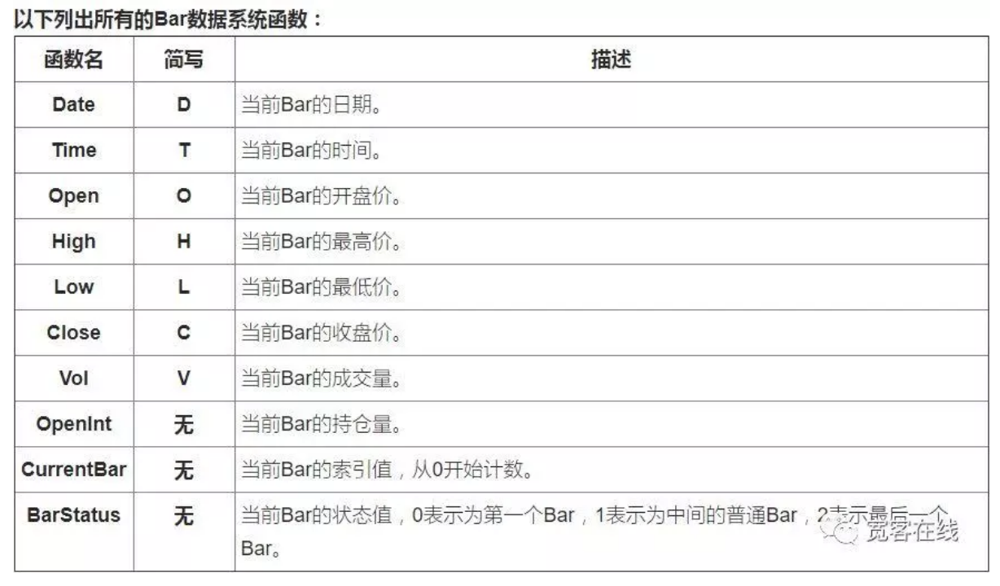
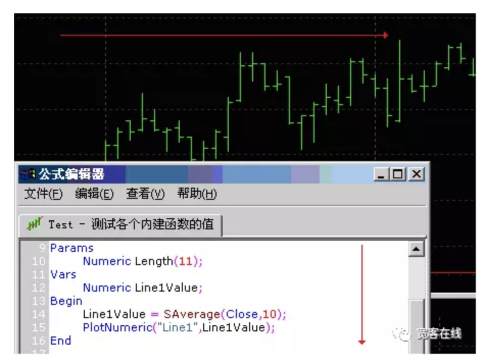
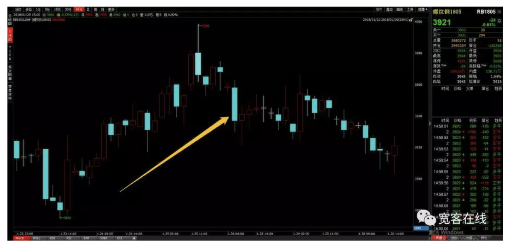
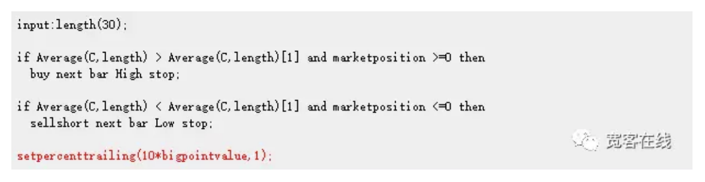
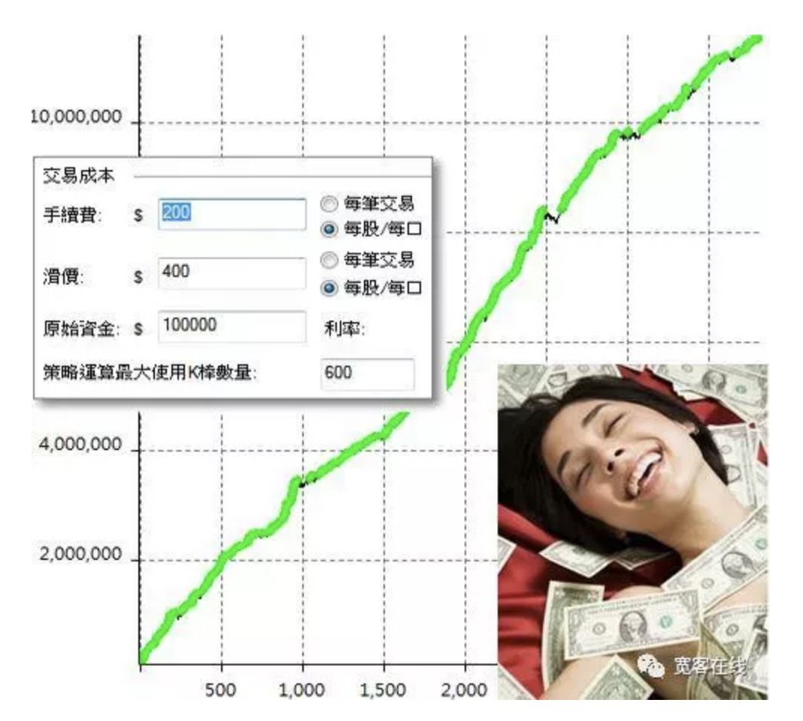
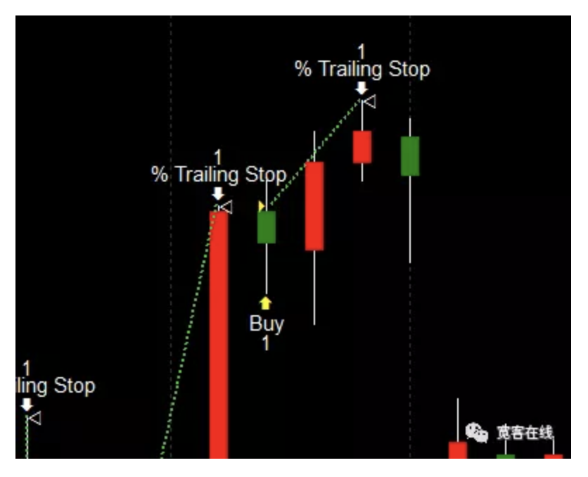
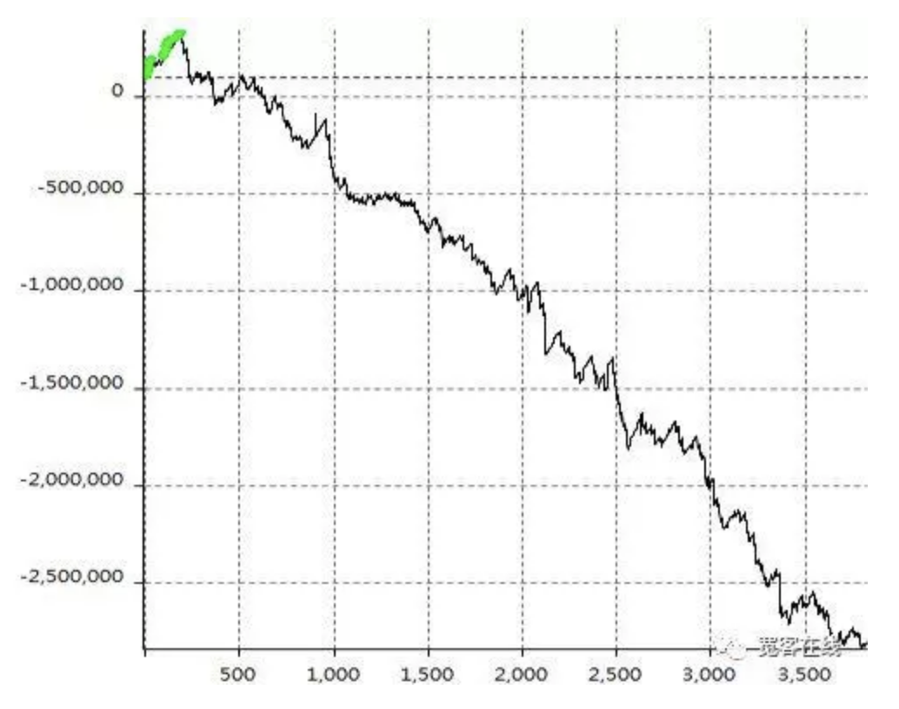
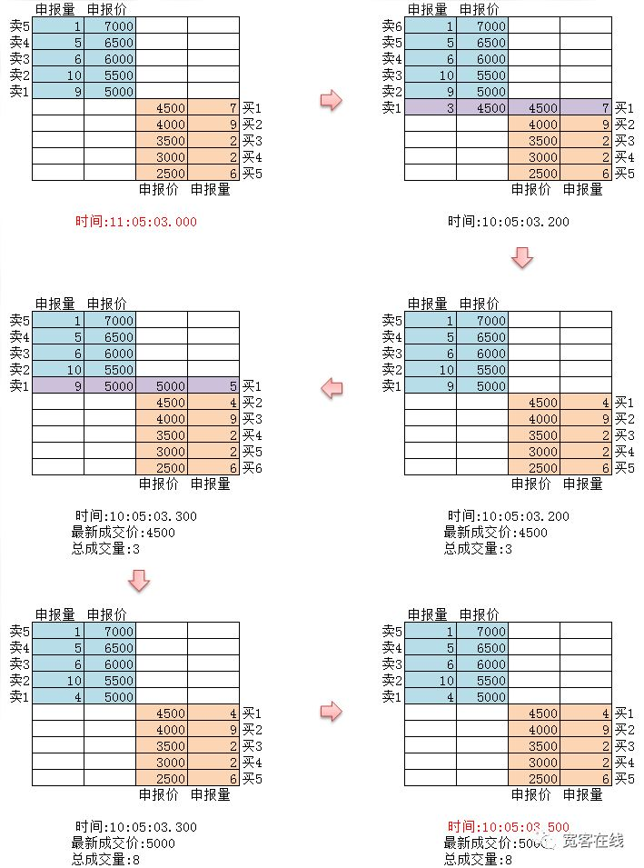

# Tick与Bar

bid price或者offer price是买方出价

# 通俗解释

- ### 什么是Bar数据

  在讲之前，先讲一下Bar数据。所谓的Bar数据，泛指普通的 K 线。在单独的每个Bar上面包含开盘价、收盘 价、最高价、最低价、成交量及时间。所有的Bar按照不同周期组合，并按照时间从先到后进行排列，由此形成为序列数据，整个序列称之为Bar数据。

  

  

  如果交易策略是基于Bar数据回测。按照Bar数据的Bar数目，从第一个Bar到最后一个Bar，依次进行计算，如果公式中出现了调用Bar数据函数的，则取出当前Bar的相应值，进行运算。如下图箭头所示，公式执行从上至下，Bar从左到右执行。

  

  Bar数据应用于非即时发单策略，是没有问题的。比如：当前条件成立，那么就在下根Bar发单。由于Bar数据量往往不是很大，在上百种上千组合回测或优化时，速度非常快。

- ### bar数据回测的弊端

  大多数量化软件中，调用那个级别的数据，就是哪个级别的Bar。5分钟周期级别的Bar就是5分钟时间序列的开高低收等。一般最小级别是1分钟，也就是回测时只能使用1分钟级别粒度的数据。

  那么问题来了，1分钟以下的数据变动是无法得知的。这种数据与当时的实际市况有所差别，一个个小的差异积累起来就造成了与真实结果的巨大差异。

  

  就拿上图中，箭头所指的Bar来说：这是根带上下影线的阴线，图表级别为60分钟，你认为在60分钟里，价格怎么运动，才最终形成这根Bar。

  答案是：有非常非常多种可能。它有可能开盘就先上涨，创造出一个上影线。然后转头向下，创造出一个下影线。然后再转头向上收盘；它也可能开盘就砸盘，直接创造出一个下影线。然后转头向上，创造出一个上影线。然后再转头向下收盘。总之，在这根Bar最终形成之前的60分钟内，价格的波动有很多种可能。

  如果即时策略用Bar数据回测，回测引擎只是根据Bar的开高低收等，做计算。因为回测引擎并不知道价格是如何跳动才形成最终的Bar。在Bar中，价格即有可能先上后下，也有可能先下后上。

  还有一个更为重要的弊端。在Bar回测中，并没有参考盘口数据，比如：买一价和卖一价。在Bar数据回测中，只要触发开平仓的价格在最高价与最低价之内，都能成交。但此时此刻如果恰好没有对手盘的话，那么Bar回测引擎在撮合的时候是检测不出来的。一次两次影响不大，但只要Bar的数据足够多，就足以产生以假乱真的虚假绩效报告。

- ### 举个栗子

  我举一个很简单的例子做范例说明。策略描述：当均线往上时往上触碰现在K线高点时作多、当均线往下时往下触碰现在K线低点时放空，另外加上移动出场─当获利大于等于10点后，折返获利1%就出场。

  代码如下：

  

  回测如下：

  

  如果你在开发交易策略的时候看到这个现象就很兴奋的以为自己发现圣杯的话... 那么你就想错了。

  钱有这么好赚就好了啦=_=。这样的回测报表一整个就是垃圾！因为那些出场点位几乎可以说都是做不到的！！

  

  上面这图，空心三角形就是出场位置的标示，看看那个出场标示在哪边？没错，就是K线的最高点，请想一想这有没有问题？我们定下的出场除了多空翻单外，就是移动出场，既然移动出场要有折返才会出场，那出场点在K线的最高点有可能吗？

  如果使用99%精度的Tick数据，回测如下：

  

  这篇简单的范例不是想指出用很灵敏的移动出场是不可行的，而是说这种的即时策略，在真实运作时会是怎样的状况？至于，造成这个垃圾回测报表的原因，我就不多叙述了。直接告诉你如何呈现实况：使用99%精度的Tick数据。

- ### 什么是Tick数据

  Tick数据就是交易所中最详尽的交易数据结构。包括：开盘价、最高价、最低价、最新价、成交量、成交额。如果把交易数据比喻成河流，Tick数据就是这个河流在某个横截面的数据。

  

  如上图所示，国外交易所每个动作都会实时推送到市场上来。而国内交易所，每秒两次进行检查，如果该时间段内有动作，则生成一次快照并且推送出来。相比较而言，数据的推送充其量只能算做 OnTime，而不能叫做OnTick。

- ### BotVS的Tick数据

  尽管国内Tick数据并不是真正意义上的 Tick，但是使用这种数据进行回测，至少可以无限接近和还原了现实。每个Tick中显示着当时这个商品在市场中的主要参数，并且在实盘中我们的代码，就是跟着理论每秒 2 次的Tick在进行计算。

  

  不仅如此，在 BotVS 中即使加载的是1小时周期的数据，依然可以调整数据粒度，比如将数据粒度调整为 1 分钟。此时此刻的1小时K线就是用1分钟数据组成的。当然，粒度越小，精度越高。

  

  更为强大的是，如果将数据切换为实盘级Tick，就可以无缝还原真实的实盘环境。即1秒2次Tick交易所的真实数据。

- ### 总结

  你不可能拿着玩具枪就上战场，不是吗？在开始实盘之前，我们都会慎之又慎。客观的压力检验，能帮你省下许多真金白银，而这些损失通常都是不必要的。

  那么历史数据的准确性就成了你的交易策略检验结果的关键因素之一，假如你的数据是不准确的，那么在这种数据下的优化和回测必然也是无法在市场中进行的。

  否则在Bar模式下看着很爽的模型，到最后变成一个很爽的陷阱......回测，就是要对自己狠一点......


------

# 换种方式解释

###  一、什么是Tick Data

> Tick Data本身并不神秘，就是交易所把每只股票（亦或是futures options）的active order book(就是你的委托还存在在交易所里面，但并且没有被撮合成交)里面的买、卖的单的情况发给你。

```
举例说明：
　　某天的市场一开始的时候苹果股票的order book（委托挂单）清空（这里不进行auction period的探讨）：
　　
　　1. 接着来了第一个卖家：1000@100 :

　　   这时候交易所会发给你一个message，告诉你是苹果股票有人想以100块钱卖出1000股，
　　
      那么这个order就先挂在了order book上，成为卖一。

　   　卖：1000@100

　　2. 第二个卖家来了，他想卖得更高： 1000@101:

　　   这时候交易所会发给你另一个message，告诉你是苹果股票有人卖的价格比你差，于是排序在更上面，卖二。

　　   卖：1000@101

　　      1000@100

　　3. 刚才的第一个卖家后悔了，cancel了他的order：1000@100撤消了，那么交易所会有message告诉你，

      现在只剩一个1000@101（卖一）。但是你可能需要自己编程处理这种remove掉一个tick的情况。

　   　卖：1000@101

　　4. 终于有买家来了... 500@90 , 这个价格是不会成交的，因为买家低于现在的最佳卖价：101，

      那么order book里面会继续存着这个order，同时会发送一个tick告诉市场上的其他人，有买单了：

   　　卖：1000@101

　   　买：500@90

　　5. 继续，接着有一位买家以101块钱买入1000股，等于要把目前的bestoffer 1000@101给match - 撮合了，那么你是不会收到这个最新的bid： 101@1000 的，

      因为它会进入matching engine的瞬间跟对面的best offer 撮合了，tick table的一个规则： bid offer 永远不会cross，

      否则要么是数据商的bug，要么是交易所的bug。现在，你只会收到一个告诉你delete the best offer的message，那么tick table长这样：

   　　买：500@90
```

**Tick数据就是这么简单，市场上会重复这个过程。**

但是比较麻烦的是：

1. 很多时候tick的数据会以UDP发送，想象股市上如果交易非常活跃，那么数据量会非常大，UDP会存在丢包情况，如何处理。曾经遇到过很疯狂的tick update但是还要保持在micro second的更新cache，可能要排序（看交易所protocol），以及发送出去给前端。

2. 如何更快的处理实时的tick数据，否则数据量如此大，一旦延迟，以后就再也跟不上“实时”的节奏了，直到你的程序挂掉。

3. 如何避免一些特殊情况造成bug，一旦一个tick没有算对，那么后面的tick table全是错的：

   

   同样，还有对tick的理解问题：不同市场的tick还有不同点，上面所说的是发达国家的股票市场，以实时情况推送（有新的order并且在tick的发送level以内，比如东京交易所只发送8个tick level，那么你看不到整个full tick的，因为可能会有100多个level，如果很多人交易的话）。

   

   国内期交所是多少个milli second截取一个快照（snapshot），上交所深交所是3秒，然后发送给你，兴许是国内交易系统已经非常古老，跟不上IT的发展了。那么这个tick数据并不是“real time”的，你只知道“哦！在前100 millisecond和现在的tick 变化是这样的”，可能中间已经成交了数千单。


### 二：什么是快照数据与交易所数据的一些细节

对于国外的高频tick数据，有完整的order数据的过程，因此你可以利用这些order数据来复原快照数据。

国内的两大股票和四大期货理论上讲都是快照数据。比如说典型的数据字段包括开盘价 最高价 最低价 最新价 成交量 成交额，这里的最高（低）价就从开盘到现在成交发生过的最高（低）价，假设你有详细的每笔成交的明细，其实这个数据是可以用max(min)推算的，所以国外的tick数据里面一般是没有这个字段的。
　　
上交所和深交所提供的实时行情有三种，**快照**和**逐笔成交**和**委托**。

快照就是每3秒一次(深交所，上交所是5秒)对市场照相，然后把现价、最高、最低、成交量、成交金额等行情相片发过来。由于照相是3秒一次，所以这3秒期间市场发生了什么，我们是不知道的。每天连续竞价时间是上下午各两小时共4小时。所以快照的次数就是14400/3大概是3800次。仅就股票来说，每天的全市场快照数据量超过2G。
　　
逐笔成交就是真实的原子每笔成交。不过这个数据也是3秒发一批，也并非实时。比如说第1.5秒发生的一笔交易，到了第3秒才发过来。
　　
委托挂单数据，Level 2里面只有买一卖一的前50，并非全部挂单。

**典型的有几类原因导致数据的差异**

- **1. 数据记录方式**

比如拿股票的Level1的数据为例，交易所发布一个dbf文件，记录着所有证券最新的状态数据，dbf文件是不断的自动刷新的。那么数据提供商或者记录数据的人需要做的时候就是每隔一段时间读取这个文件，然后把所有的数据放入数据库，但是因为交易所更新数据的频率不是一个唯一值，所以为了不错过数据，最好的办法就是你读取的频率高于他更新的频率。这样问题就来了，因为你读取很多如果每次都记录下来一来数据很大，二来很多重复数据。所以大家往往使用的办法就是当这条数据有变化的时候我才放入数据库。

因为有这样一条规则，所以你看到的一些非活跃成交的证券数据量会少于活跃成交的证券，远期的期货数据少于近期的，时间戳不同步等问题。

- **2. 运维问题**

谁也不能保证不会断网。如果发生断网、机器错误、程序错误等原因，就会错过交易所数据播放。按照前面所述的数据机制，其实对于Level1数据T和T+1时刻是没有任何逻辑关联的，假设缺失了你不可能从数据本身发现，因此大量的缺失其实都是这些原因造成的，而且无法弥补！就好比早期的电视录像带很不清晰，但是过去已经过去你已经无法补救。

- **3. 程序导致的数据错误**

一些比较异常的错误，比如说某些类型股票的价格出现异常，空等等，可能因为录数据的程序的错误造成的。为什么会出现？反正理由也很多，我们知道会出现就可以了。少部分是因为交易所的问题，比如说交易所曾经把Level2数据的开盘价发错了。因此原则上很难有100%可信的数据，数据的检验和清洗是必要的，也是一个枯燥的事情，规则的设立也看个人的经验。

------


### 三、Bar 的概念

在一定时间段内的时间序列就构成了一根 K 线（日本蜡烛图），*单根 K 线被称为 Bar*。

如果是一分钟内的 Tick 序列，即构成一根分钟 K 线，又称分钟 Bar;如果是一天内的分钟序列，即构成一根日线 K 线，又称日线 Bar;

Bar 的示意图如下所示：

[](https://gss0.baidu.com/9vo3dSag_xI4khGko9WTAnF6hhy/zhidao/pic/item/e61190ef76c6a7efff24d318f0faaf51f3de6689.jpg)

Bar 就是时间维度上，价格在空间维度上变化构成的数据单元。如下图所示，多个数据单元 Bar 构成的一个时间序列。

[](https://gss0.baidu.com/-4o3dSag_xI4khGko9WTAnF6hhy/zhidao/pic/item/5366d0160924ab1813d69a0938fae6cd7a890bcf.jpg)