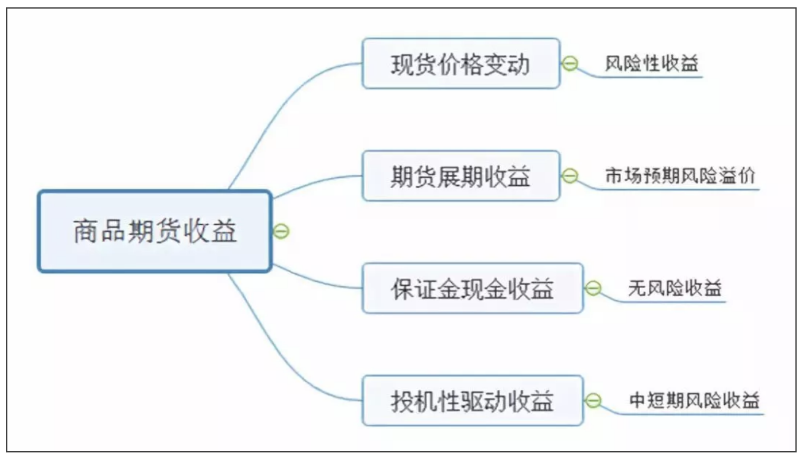
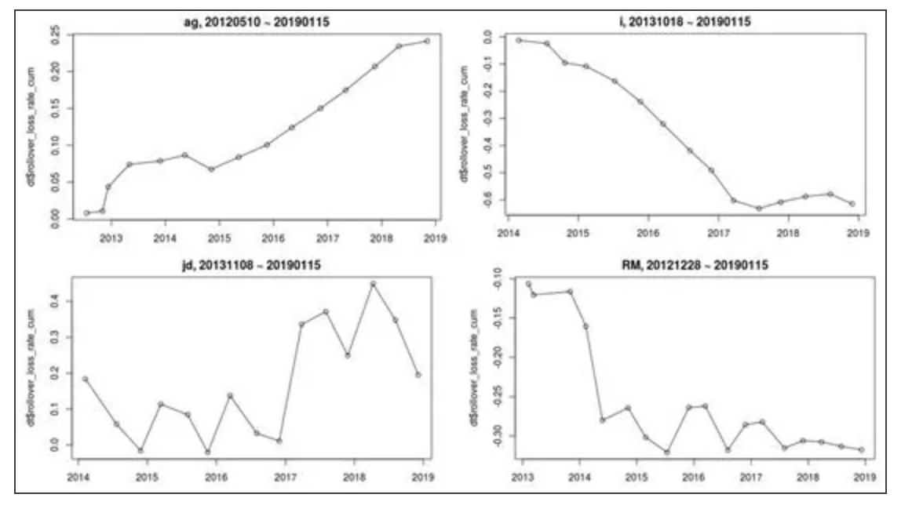
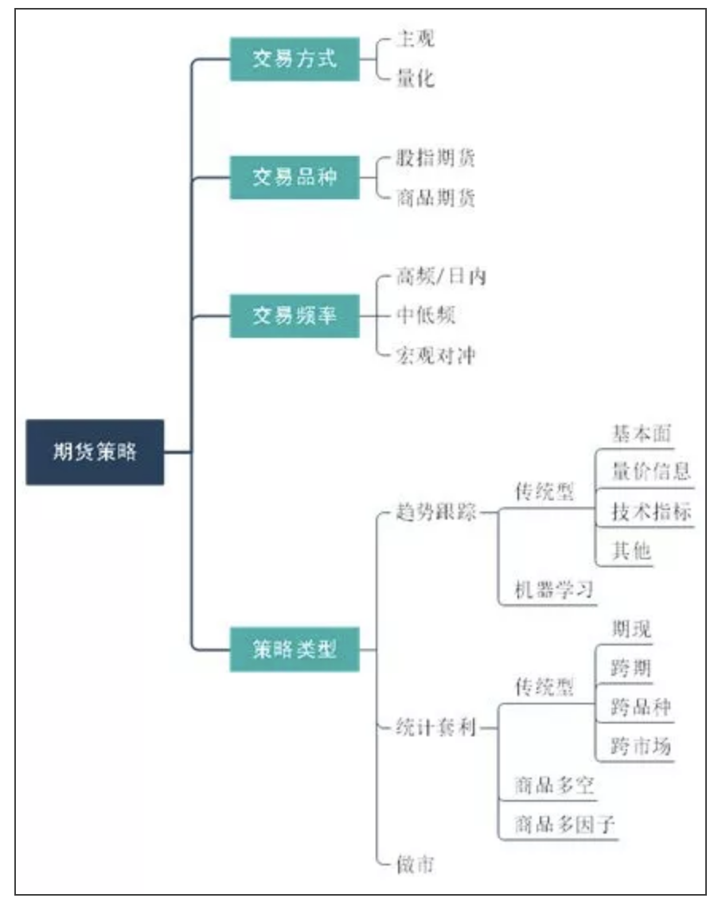
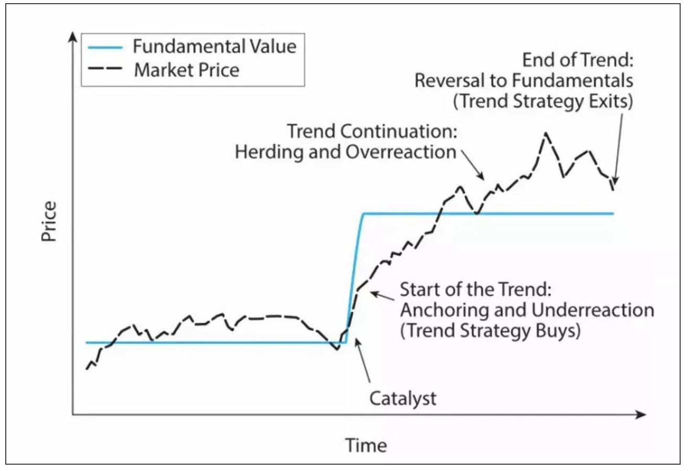
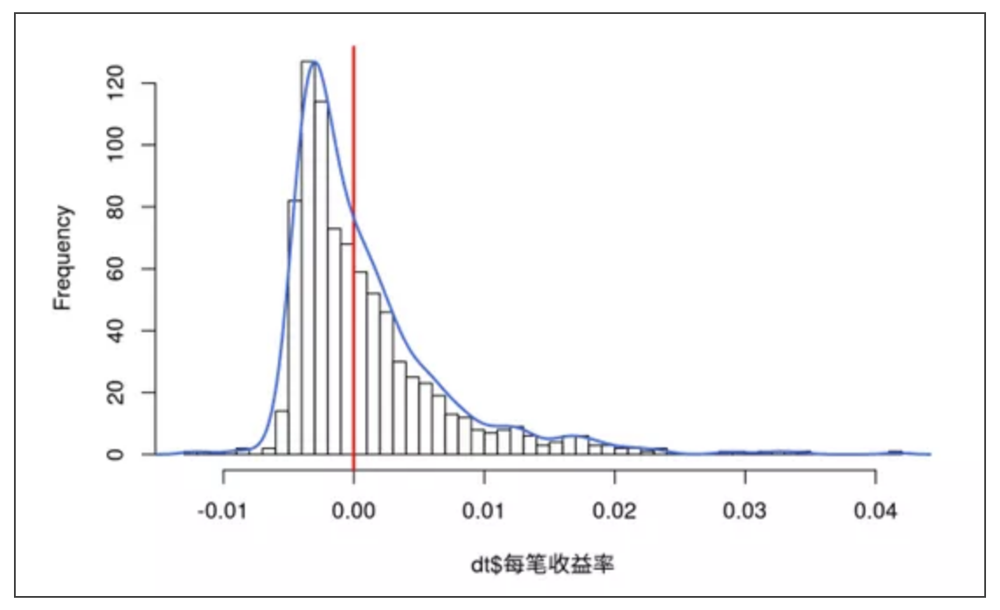
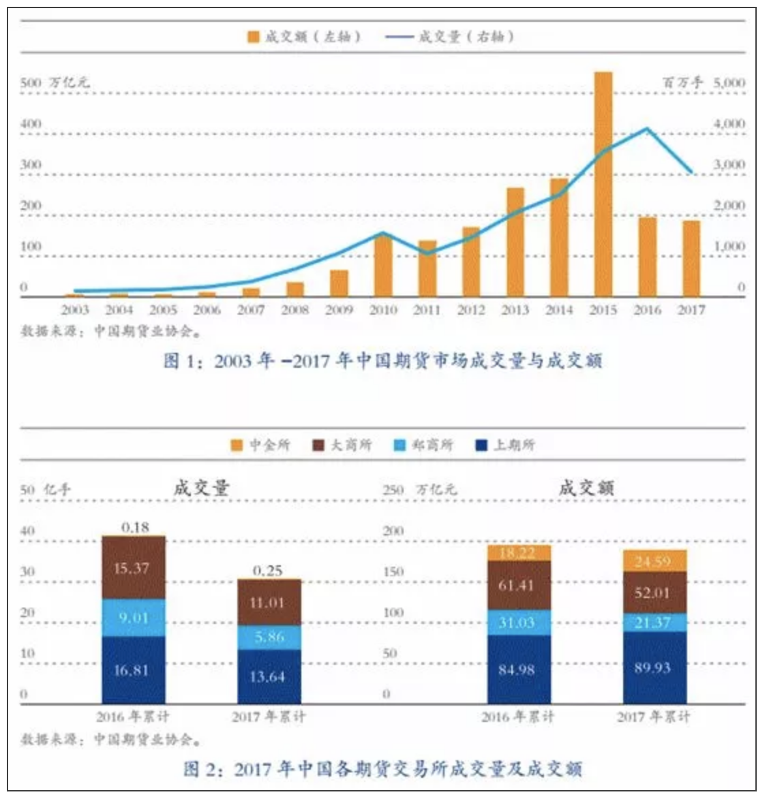
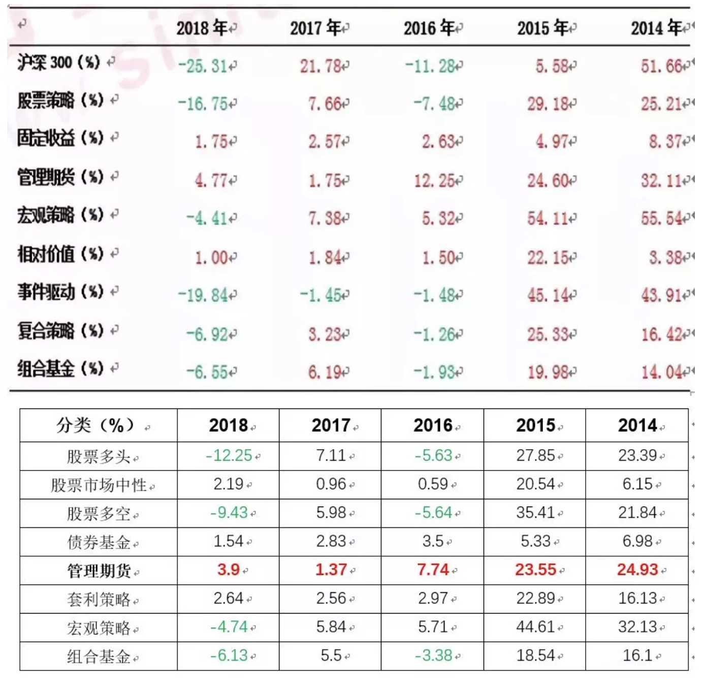
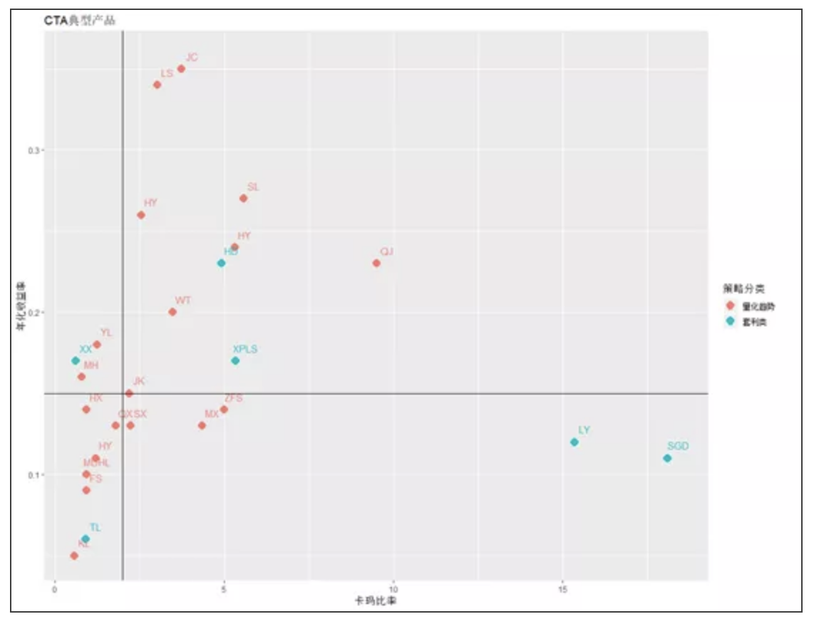

# 一文综述CTA策略及行业发展现状

>  易金超 [淳臻投资]

**目   录**

**一、CTA策略**

**1、期货概述**

**2、交易标的**

**3、收益来源**

**4、策略类型**

**5、风险因子**

**二、CTA产品及投顾**

**1、运行模式**

**2、收益特征**

**3、产品容量**

**4、业绩表现**

**5、配置功能**

**三、CTA行业**

**1、国外发展历程**

**2、国内发展历程**

**3、行业格局**

**4、未来展望**

**一、CTA策略**

**1、期货概述**

​       期货是跟现货相对应的概念。根据书本定义，期货（Futures）是根据某种标的物而设计的一种标准化可交易合约。这类标的物既可以是某种商品（比如黄金、原油、农产品等），也可以是金融工具（比如股票指数等），买卖期货的合同或协议叫做期货合约，买卖期货的场所叫做交易所。

​      中国证监会原副主席姜洋博士出版的新书《发现价格：期货和金融衍生品》一书中，对期货功能的论述很多，有兴趣的读者可以去阅读原书。他在书里面摘取了1985年美国四部委给国会提交的《期货期权交易对经济影响的研究报告》结论：“美国期货和期权市场为需要管理风险的市场主体提供了避险工具，具有价格发现、定价基准和套期保值的功能，在提高现货市场和实体经济的流动性及稳定性等方面发挥了重要作用。”姜主席在书中也从**价格发现、风险管理以及投机能量**等几个方面详细讲述了期货针对不同参与者的功能定位，非常全面。由于期货一开始在中国发展也经历过一段“野蛮生长”阶段，造成很多人对期货有很多误解。其实期货只是一种工具，标的涨跌幅限制一般比股票还小，如果是不带杠杆操作，风险不一定比股票高。但由于期货具有杠杆交易、T+0以及多空操作等特点，如果把握不好尺度，也很容易造成较大风险。

​      期货市场主要就三类参与者：**套期保值者、套利者、投机者**。套期保值者很容易理解，现货参与主体为了锁定未来一段时间的价格波动风险，买入或卖出期货进行套期保值。套利者主要是发现市场短期出现定价错误，然后通过多空方向交易进行套利交易。投机者这里定义为单边交易者，参与者对市场行情有自己的判断，然后进行趋势交易。期货市场的价格发现与套期保值功能主要是套利与投机者提供的，价格发现依赖的流动性是后两者创造的，套期保值者的机会也是套利与投机者频繁交易的流动性形成的。如果光有套期保值者，市场缺乏流动性，套期保值成本高效率低，所以套期保值者、套利以及投机者共同构成了一个微生态，缺一不可。

**2、交易标的**

​       国内主要交易的CTA标的物是**股指期货、国债期货及商品期货**，其中股指期货包括沪深300、中证500及上证50，国债期货包括2年期、5年期及10年期，商品期货包括上海、大连、郑州三大交易所交易的近50个标的品种。期货本质是一种风险管理的工具，最开始是给（产业）客户套期保值，参与者除了套保者，还有套利者以及投机者，三类参与者共同构成了市场生态。从标的上看，股指期货、国债期货与商品期货还是有很大的差异性。股指期货2010年4月16日开通以来，到2015年股灾之前，交易量都非常活跃（高峰期日交易额超过万亿），是管理市场系统性风险（Beta）的工具，流动性非常好。股灾之后，政策层面对股指期货进行了各种限制，导致股指期货流动性萎缩，成交量仅为高峰期的1-5%不等。国债期货开通以来，由于没有引入商业银行等交易对手入市，加上开户条件要求比较多，交易量相对还是比较小。国内商品期货市场经过各种整顿与发展，现在交易量位居世界前几位。根据中国期货业协会的统计，2017年国内期货市场日均交易额为7700亿元。

**3、收益来源**

​       很多人觉得期货交易扣除手续费后是一个负和博弈游戏，能够在里面盈利的人比例很低，持续盈利就更难。但是笔者认为不能光从从交易结果层面去判断期货交易的价值，而应该从期货的社会功能以及社会价值等方面去综合考虑。从市场交易中获取（超额）收益的主要来源，归根结底分为两类，**一类是利用市场一定时间内的无效性或者别人犯错，比如套利类策略，等待回归收敛。另一类就是承担了某种风险的风险溢价（Risk Premium）而获取超额收益，比如说趋势跟踪****。**要探究CTA策略的收益来源，我们不妨先从其交易标的收益来源进行分析，考虑到金融期货（股指期货跟国债期货）底层资产不是实物标的，我们这边参考Antti Ilmanen所著《Expected Returns》一书的论述，选取商品期货进行分析（金融期货逻辑类似）。  

​        

Ilmanen一书将商品期货收益分解为**现货价格变动收益、期货展期收益、保证金现金收益及投机性驱动收益**四个方面构成。

​        **第一个方面是现货价格变动收益****。**现货价格变动可以由很多相关的因子（因素）进行解释，比如说基本面、供给与需求差、宏观经济指标、气候变化等等。从现货价格出发，可以做基本面的**行业版块对冲**，比如黑色、贵金属、化工等；也可以根据现货、期货以及相关股票进行操作做**宏观对冲**；另外现货价格变动还可以做**量化多空**，做多某些品种或者板块，相应做空某些品种或者板块；也可以做**趋势跟踪或者趋势反转（回归）策略**，大级别（月度、季度、年度）的趋势行情形成，很多时候都少不了基本面因素推动。基于现货价格变动设计的策略，持仓周期一般都比较长，往往可以容纳比较大的资金容量。有些私募投顾之前从期货公司、现货公司出来的，结合期现联动，做的很有特色，特别是杭州一带。

​        **第二个方面是展期收益****。**展期收益这里也列出了几点，一个是便利收益（Convenience Yield），拥有现货的便利所能带来的收益。便利收益的强弱状态跟存储成本、资金成本、税收政策等因素都有影响，便利收益的强弱状态又会进一步对期货以及现货市场价格产生影响。由于期货合约都是有期限的，到期要滚动到新的合约，从现货跟期货的展期收益可以拓展到（不同）期货不同合约的期限结构关系，也即是我们俗称的Carry效应。不同品种升水（Contango，远期价格大于近期）跟贴水（Backwardation）的影响因素还是很复杂的。很多研究发现升贴水方向跟力度与供需对冲压力、库存水平等方面都有关系。从展期这个角度出发，可以衍生出**期现套利（商品的只能通过期货子公司签署场外期权来实现，现在政策上多有限制）、跨期套利、跨品种套利、季节性多空套利、跨境套利等策略。**套利类策略也不是简单一个协整关系，更不是无风险的策略。套利除了要考虑不同的因子影响，以及它们在不同的期货品种上影响的力度和方式不同，还有在不同的时点影响可能也是不一样的。

​       我们这里以主力合约切换合约拼接的期限结构图为例，白银是升水结构，铁矿石是贴水结构，而鸡蛋跟菜粕一个是升水一个是贴水结构，季节性特征明显但是力度每年都不一样。这些结构的形成要结合资金成本、储存成本、季节性因素等多方面来考虑，所以基于这些逻辑来设计套利策略时也要格外小心。

​       **第三个方面是保证金收益以及抵押收益****。**保证金现金收益就是期货账户里面的保证金有一定的利息收益，但是基本上是归期货公司所有，这也是很多期货公司利润来源之一（因为扣除返佣，期货公司靠手续费很难赚钱，即便是高频交易扣除返佣及机房、机柜投入，利润也很低）。抵押收益是说期货自带杠杆，比如说10%的保证金就可以买100%市值的合约，其余的90%可以去做现金管理或者其他投资收益（很多CTA产品保证金占用一般20-30%，其余资金可以做现金管理或者其他投入，所以从这个层面说CTA产品很多可以做到本身自带一定的安全垫属性）。

​       **第四个方面是投机性驱动收益****。**投机性需求包括短期的资金流动、政策冲击以及市场情绪导致波动放大等等。比如2015年7、8月股指期货受限之后，大量投机资金涌入商品期货领域，导致商品期货有些板块短期内暴涨暴跌。还有就是最近由于特朗普关于原油的一系列发言加上贸易战，导致原油期货大幅下跌（国内原油期货2018年12月25日跌停至8%）。投机性需求导致短期市场脱离基本面，短期内导致市场失效，加上情绪的反身性影响，这种脱离或者波动会持续一段时间。

​       **对某个品种过度投机容易导致逼仓现象****。**期货逼仓是指期货交易会员或客户利用资金优势，通过控制期货交易头寸或垄断可供交割的现货商品，故意抬高或压低期货市场价格，超量持仓、交割，迫使对方违约或以不利的价格平仓以牟取暴利的行为。根据操作手法不同，又可分为“多逼空“和“空逼多”两种方式。“多逼空”容易出现在小品种上，多头利用资金优势建立大量多头头寸的同时，收购与囤积可交割实物。“空逼多”是空头大量卖出头寸打压价格或者预估买方实力不够接货。逼仓现象容易导致某个品种在短时间内暴涨暴跌，最后一地鸡毛，往往导致该品种后期鲜有流动性而成为“僵尸”品种。

​       投机性驱动催生**趋势跟踪、短线多空、高频套利**等策略。CTA程序化领域的策略很多集中于投机性驱动催生的行情中，因为这些策略更多关注量价，而不需要对现货或者基本面进行深入研究。

​       现货价格变动收益、展期收益及投机性驱动收益，只是对期货收益做一个简单的分解，真正的情况比这个复杂而且很难准确去估算各个收益的具体大小，三者之间也不是独立的，比如投机性驱动收益和现货价格的相互作用，像索罗斯写的金融炼金术，重点讲的概念就是反身性。比如，本来原油的供需基本面是比较稳定的，最近一波投机价格被炒作爆跌，导致有些国家减少生产，然后就改变了基本面，基本面改变会使得供给曲线上移而产生新的均衡价格，所以他们之间是高度相关的，只不过影响的时间周期上是有一定滞后的。

**4、策略类型**

​        从上面对期货收益来源分解我们可以知道，不同的参与者根据自身资源禀赋，对期货交易策略的关注点也会不一样。有些做基本面出身的，他们更关注现货价格变动或者展期收益的影响；有些对基本面不了解的，可能更多从量价角度来研究量化策略。不同人思考问题的参照系或基准点不一样，导致策略逻辑、交易频率、对技术的要求也不一样，对市场预期也不一样。正因为这样，才造就了期货市场这个大生态。如果大家预期一致，就找不到交易对手了。

​       

​       CTA策略类型很难从一个维度来贴标签。上面简单列了一个图表，从不同维度进行分类。如果从**交易方式**来看，有主观CTA与量化CTA之分，我们后面主要讨论量化CTA。从**交易品种**来说，有相对单一化CTA以及多元化CTA之分，相对单一化CTA比如针对股指期货或者某类商品的CTA，多元化CTA就是交易品种多样化，尽可能做到分散。从**交易频率或者周期**来讲，有高频、中低频、宏观对冲（商品作为配置的一部分，宏观对冲超出笔者知识范畴，后续也不做过多讨论）。高频交易主要有做市、套利或短期预测等方式，对交易系统要求非常高（低延迟、FPGA、C++、Co-location、行情专线、独立交易单元等，想了解交易系统方面更多信息请移步[一文读懂量化系统接入及相关平台](https://mp.weixin.qq.com/s?__biz=MzI4ODA4MTExMg==&mid=2647729840&idx=1&sn=1bcc43ed4afed54e043e6a345c75389d&scene=21#wechat_redirect)），容量也相对有限，中低频策略对交易系统要求没有这么高（量化类CTA基本上也都是全自动交易，托管在机房），容量也比较大。宏观对冲类一般对速度要求比较低，结合股、债等方面配置，容量也相对较大。

​      如果从**策略类型**来分，主要可以分为**趋势跟踪、统计套利、做市**为主。做市策略由于比较小众，这里不展开来讲。

​       **趋势跟踪策略历史悠久，也可以说是 CTA策略的主流策略****。**CTA趋势跟踪类策略也经历过多轮迭代，从80年代最开始的简单量价类策略发展到现在用机器学习来做预测，意图抓住不同周期上的趋势（趋势周期视策略而定）。在A. Greyserman和K. Kaminski合写的《Trend Following with Managed Futures》一书中列举了趋势形成的很多既成事实，大家可以去参阅。大量的学术文献从横截面动量（Cross-sectional Momentum,见Pirrong（2005），Miffre and Rallis（2007），Asness, Moskowitz and Pedersen（2009））、时间序列动量（Time Series Momentum, 见Moskowitz, Ooi and Pedersen (2012), Burnside et al (2011)）、收益序列相关性（Serial Correlation in Returns，见Sagi and Seasholes (2007), Liu and Zhang (2008)）、容量约束以及行为金融等方面来解释为啥会形成趋势以及趋势策略在期货市场的有效性。

​         行为金融的解释颇具新意，这里借用Hurst, Ooi and Pedersen (2013)论文的截图来说明趋势如何形成、延续以及结束。趋势启动最开始都需要某个催化剂，比如说利好或者利空消息（例如供给侧改革、需求端偏移）。趋势开始形成之后，一般参与者都对信息反映不足，这里面有锚定效应、信息传导不充分、处置效应或者摩擦成本等因素。第三阶段是由于羊群效应、确定偏差或者代表性偏差以及资产滞后配置等，市场过度反映导致趋势可以延续。最后就是趋势结束，行情反转。

        

​       趋势策略一般都是偏右侧交易，俗称“追涨杀跌”，一般可以吃到趋势比较流畅的中间部分，最后趋势反转也相应离场。**这类策略的交易特征是胜率（盈利交易次数除以总次数）相对比较低，但是盈亏比（平均每笔盈利除以平均每笔亏损）比较高，应该来说是反人性的一类策略。**

​        **传统套利策略**通过交易两或者多个（组）相关的品种，做多价格低估的品种（组），做空价格高估的品种（组），期望从两者的价格回归中获取价差收益。具体包括期现套利、跨期套利、跨品种套利、跨市场套利等。传统套利策略是赚错误定价均值回复的钱。现在有些投顾借鉴股票多因子的方法，计算不同因子值，然后进行多空组合交易，本质上也是统计套利。但是商品多因子方式由于标的少（具有流动性及波动性的商品标的就几十个），横截面上显著性值得怀疑（N问题），还有一个问题就是除了初始市值中性，其他中性很难做到，有些时候双边暴露风险，特别害怕尾部风险（这点倒是跟大部分趋势策略互补）。**统计套利类策略一般胜率高，但是盈亏比比较低，相对来说是比较符合人性（人都喜欢笔笔赚钱），但也不能低估其潜在风险。**

**5、风险因子**

​       上面讨论了期货收益的来源以及策略类型，再往下一个层面就是风险因子，就是策略取得（超额）收益暴露了哪些风险因子。股票交易里面我们经常讲Risk Factors 跟Alpha Factors，大家都希望能够找到阿尔法因子。但是事与愿违，阿尔法因子是很难找的，或者持续周期很短就变成风险因子了。股票多因子模型主要是基于横截面统计显著性，然后做一系列中性化处理之后，通过因子收益模型（Factor Return Model）、风险模型 （Risk Model）、组合优化模型（Portfolio Optimization Model）及业绩归因模型（Performance Attribution Model）进行系统化投资。CTA策略有其特殊性，因为期货多空都能交易，股票多因子里面的因子收益还是基于股票多头累计的结果，期货在里面只是一个对冲工具。CTA策略（趋势跟踪或统计套利）尽管底层也受到诸如经济增长、波动率、Carry、流动性、尾部等风险因子的影响，但是这里不严格参考股票那边的定义，这边论述CTA风险因子是一种广义上的概念，跟股票多因子还是有一定的差异性。

​       **在趋势跟踪传统策略中，可以把单独的某一策略当作为一个因子（有别于直接把动量之类作为一个因子）**，因为单个策略包括**入场、离场、滤网、资金管理**等方面的东西，是一种脉冲式触发机制（Impulse Respose），跟传统股票多因子一篮子交易不一样。单个策略的累计收益曲线可以近似来监控各个品种的交易机会。策略逻辑可能是来自基本面、量价、形态、微观结构、市场情绪等等，这些都可以作为策略来实现，然后来跟踪效果。如果基于机器学习来做趋势预测的策略，**信号机制一般是定期计算触发**，也可以形成很多不同的子策略。**多个子策略进行组合，如何优化这些权重，哪些品种该多配或者少配，可以类比成多因子模型的组合优化步骤，只是没有相对固定的模型来处理，这是区分每家CTA基金业绩差异的重点，也是难点。**

​       对于统计套利类，传统的价差、基差那些都可以作为因子来监控，然后超过一定的阈值进行双向交易，这种机会也是脉冲式触发，而且回测相对困难，因为本身对交易系统及市场微观结构要求很高，比较容易监控的是信号指标，然后根据一定的规则来确定交易机会，形成净值曲线。期货市场传统套利本质上还是基于流动性溢价，参与者一多也就拼速度了。基于量化多空的多因子框架，这个跟股票类似计算因子值，比如动量因子，波动率因子、库存因子、升贴水因子等，然后根据因子值设置交易组合，计算多空组合的累计收益，可以把累计收益曲线当做因子的效果来评价。**这类策略的信号机制一般也是定期计算触发****。**但是这类因子要关注的问题就是横截面统计是否显著、比较难中性化（除初始市值中性外）处理带来的双边头寸风险，特别是持仓周期越长风险越大（市场上有用这类逻辑的产品回撤幅度达到20-30%，当然不排除其他原因），所以这类策略暂时还是很小众。

​       **单个策略（或因子）都具有周期性****。**如何根据市场的情况，对各个策略进行参数优化、对权重进行调整、开发新的策略，是CTA策略不断进化的要求。

**二、CTA产品及投顾**

**1、运作模式**

​        CTA基金也称作管理期货基金，名称也是舶来品，是由专业的投资管理人运用客户委托的资金投资于全球期货市场、远期及期权市场，以追求盈利为目的一种基金管理形式。传统意义上的 CTA 基金的投资品种仅限于商品期货，但随着近年来全球期货市场的发展， CTA 基金逐渐将其投资领域扩展到包括利率期货、股指期货、外汇期货在内的几乎所有期货品种。CTA 产品在国内主要通过私募基金、公募专户、券商资产管理计划、期货资产管理计划等途径发行。CTA产品根据不同的风格可以贴不同的标签。从交易标的上，有些产品或者投顾侧重于股指期货，有些侧重于商品期货，也有做全品种的；从交易频率上，有些侧重于高频，有些侧重于中低频；从策略类型上，有些侧重于趋势跟踪，有些侧重于统计套利。从国内CTA投顾情况来看，上述风格标贴的产品基本上都能找到，但是更多是不同风格标签的混合体。

​       **从产品净值以及客户预期管理的角度出发，复合策略是现在很多产品运行的通用模式****。**复合策略不单单是一类策略，可能既有趋势策略，也有套利策略，交易频率上也不同，只是比例多少的问题。采用复合策略原因还要从CTA交易标的行情的历史特征来分析。从历史回顾来看，期货单边趋势行情相对来说还是比较少，大部分时间都是震荡为主，趋势策略在震荡行情下回撤较大，如何控制回撤是产品以及投资者预期管理的大问题。有些CTA产品是通过“**多品种、多参数、多周期、多策略**”来降低回撤，有些产品是通过加入统计套利类策略来控制回撤。由于期货自带杠杆，所以一个产品大部分资金可以去做增厚收益的投资（比如逆回购或者投资低风险债券等方式），放在期货保证金账户里面的资金一部分做趋势跟踪策略，一部分做套利类策略，这样整体希望让资金曲线走势相对平稳。CTA产品资金曲线多呈现阶梯跳跃状（纯高频及套利策略除外，趋势策略为主的话），一波趋势行情净值创新高，然后震荡行情进入回撤横盘状态，等待下一波趋势行情再创新高。**如果说抓取上涨或者下跌趋势是市场给的Beta机会，那么如何在震荡行情下控制好回撤幅度以及最大回撤周期就是考验每个投资经理或者产品的Alpha能力。**

**2、收益特征**

​       CTA归为一类策略，有其特殊的背景与原因。这里有必要先比较一下CTA策略与股票策略的差异。首先，从标的属性看，期货属于消费品属性，全球供需定价，不适用资产定价模型（Capital Asset Pricing Model）；股票属于资本品（Capital Goods），有分红，可以股利贴现，适用资产定价模型。其次，期货参与者是套期保值者、套利者以及投机者；而股票参与者是股东、价值投资者以及投机者。第三，从交易规则来看，期货T+0、多空交易以及保证金交易制度；而股票是T+1、基本上只能做多（融券做空有限）且一般需要全额交易。最后，从研究方式来看，期货策略以趋势策略为主，统计套利为辅；而股票量化策略多以多因子框架（包括基本面、高频量价）为主，事件驱动为辅。

​       正是基于期货以及CTA策略的特殊性，其收益特征跟股票类策略具有较大差异。除了少量高频策略以及套利策略净值曲线是呈现对角走势上扬外，大部分CTA产品业绩曲线都呈现以下几个特点：第一，收益分布非正态且具有**正偏性（Positive Skewness）**（见下图），大部分曲线都是阶梯式上扬。第二，与其他策略（比如股票市场中性、债券策略等）具有**低相关性**。第三，CTA策略具有**“****危机阿尔法（Crisis Alpha ）”属性**。 CTA策略不仅仅是趋势跟踪,但大家讨论CTA策略更多是指的趋势类策略，因为趋势类策略除了容量之外，还能够抓住“黑天鹅”。关于这些属性的讨论有很多文献可以参考。

**3、产品容量**

​       **收益、回撤（风险）与容量是不可能三角****。**收益高、回撤小，容量肯定不大，比如高频策略（否则用反证法即可证伪）。收益高、容量大，回撤肯定小不了。抛开风险（回撤幅度是其指标之一）谈收益没意义，由于CTA策略收益分布的非正态性，所以夏普比率更多只是一个参考，CTA策略更多是参考卡玛比率，即风险收益比（RRR）。

​       关于CTA策略容量，要根据不同策略类型来分析。根据统计，2017年国内期货市场日均交易额为7700亿元，按照平均12%的保证金比例计算，日均保证金交易规模约924亿元。这个日均成交额主要是商品期货的交易额，因为股指期货流动性受限。假设按照日均保证金交易规模15-20%算作CTA基金期货保证金规模，其金额是138-185亿元之间。由于CTA基金保证金一般只占基金份额的15-20%左右，按照这个比例我们让保证金金额乘以5倍，倒推CTA基金广义规模可以达到690-925亿元之间。

​       上面只是简单匡算，不同策略类型的容量也是不一样。通过与同行交流预估，趋势类低频（平均持仓周期超过一周）规模相对较大，单个保证金账户数亿资金都不是问题；趋势类里面如果是日内策略为主，则容量也相对有限，除非股指期货放开；如果是以tick级别的高频，则每个账户都是千万级别左右或者更少。套利策略如果是中低频，容量也比较大，单个账户可以是亿元级别，如果是tick级别高频，则每个账户也是千万级别左右或者更少。

​       研究CTA基金，不能光看业绩，因为收益高回撤小的曲线基本上是给自营资金或者不接受外部资金的委托，容量是需要考虑的一个要点。很多时候漂亮的曲线可能只是宣传的一个噱头，要多一份谨慎。

**4、业绩表现**

​       为了展示CTA策略整体表现，笔者分别从私募排排网以及朝阳永续摘取了2014-2018年各个大类策略整体平均收益情况。我们发现管理期货作为大类策略，每年都保持了正收益。2014-2015年是大年，2017年是低谷，2016及2018年大幅跑赢其他策略。

​      下面这张图选取了市场上一批公司成立较早、产品业绩有持续更新、且都有一定特色的CTA投顾产品来画像（投顾名字用拼音首字母代替），横轴是卡玛比率（年化收益率除以最大回撤幅度），纵轴是年化收益率，两条黑线分别代表卡玛比率为2以及年化收益率为15%。首先要承认这些投顾典型产品本身就存在幸存者跟选择性偏差（Survivorship Bias & Selection Bias），只有存活下来且业绩表现相对好的投顾或者产品才放在上面。画这张图的意思也是想说明，无论是趋势跟踪还是套利类策略，同类策略不同产品之间年化收益率以及卡玛比率也存在较大差异。另外就是抛开规模来谈业绩是不现实的问题，考虑到规模因素，好的产品能够做到年化收益率15%，卡玛比率2附近就相当不错了（根据Eurekahedege CTA指数计算，国外CTA指数年化收益率9%，卡玛比率才1.26左右）。

**5、配置功能**

​       CTA基金一般都以追求绝对收益为目标，本身单独就可以作为一类产品进行运作。而且CTA策略本身也可以作为增厚收益部分，跟很多其他策略（由于杠杆效应，产品多余资金可以配置现金管理、债券或者股票中性策略等）进行搭配，丰富产品类型。

​       另外一方面，CTA策略由于其与其他策略的低相关性以及具有抓取“危机阿尔法”的属性，是资产配置领域里面不可或缺的一块。组合配置里面加入CTA策略一般都可以**改进风险调整收益、减少回撤幅度并改善偏度性质**。从很多文献中也讨论到，趋势跟踪（动量）策略可以被视为经济下行趋势中的保险策略（也被称为尾部保险，Tail Protection）。

​       当下FOF流行，CTA基金也是很多FOF配置中的一环。CTA基金在FOF中的定位首先取决于FOF的定位。FOF可以是纯CTA FOF，也可以是量化FOF，或者量化跟主观结合的FOF，FOF定位不一样，CTA在里面的角色也不尽相同。

​       如果是**纯CTA FOF**，这个首先就要考虑到容量问题，现在市场上纯CTA FOF规模既可以千万级别，也可以做到数亿不等。FOF规模小做纯CTA FOF也有比较优势，因为申购赎回比较方便，不会像股票一样还有停牌现象。通过不同周期、不同品种、不同策略的逻辑进行搭配（这些策略本身相关性也较低），也能取到不错的效果，可以主打“小而美”。做这类纯CTA FOF，FOF管理者要充分了解投顾细分策略类型、风格特征以及策略周期，并根据自身需求适当分散配置。不同的 CTA 细分策略具有不同的风格特征且差异较大。

​       如果是**量化FOF**，CTA基金除了收益方面的考虑之外，还具有与其他策略的低相关性属性，CTA基金是配置里面不可或缺的一部分。量化FOF除了要了解细分策略及风格特征之外，也要关注CTA投顾管理规模与其策略容量的匹配性问题。与股票策略可以容纳较大资金规模不同（好的股票策略容量也受流动性等因素影响），CTA 策略可容纳的资金规模与市场流动性、监管政策、策略类型、交易周期等多种因素有关。

​       如果是量化跟主观结合的**复合FOF**，这种FOF一般规模比较大，CTA基金在里面更多是利用低相关性，对冲风险。这类FOF选择CTA基金可能更侧重于中低频策略且策略成熟度高、运行时间较长且风格稳定的投顾。

**三、CTA行业**

**1、国外发展历程**

​       CTA基金在国外也是80年代伴随期货市场的发展才开始兴起，初期规模也相对较小，后面规模逐渐增长。从国外几个对冲基金网站的数据统计来看，现在规模在2000-3000亿美元之间。从最新的CTA Intelligence统计的2018年前50大CTA管理公司来看，Man AHL规模达到251亿美金规模重返第一，AQR以205亿美金位居第二，Winton以131亿美金位居第五（元盛统计规模下降从网上报道得知一方面是策略转型部分规模没有计入CTA，另外一方面是客户赎回）。从统计结果还可以看出，伦敦（或者欧洲，包括荷兰、瑞典）跟美国仍然是CTA基金两大主力阵营，头部效应非常明显，前10大CTA（还包括Two Sigma, Graham Capital, P/E Investment, Systematica Investments, Millburn Ridgefield, Alpha Simplex, Fort）公司占据了前50名的大部分份额。

​       无论从Barclay CTA Index还是Altegris 40（组成成分是40只领先的管理期货基金）指数来看，CTA策略从80年代到2008年业绩都平稳上扬，但是从2009年到2013年，很多CTA基金处于横盘或者回撤过程中，其中一个解释是金融危机之后金融资产的相关性变高，导致CTA策略没法做到分散化。具体讨论我们这里选择大家非常熟悉的元盛为例。元盛成立于1997年，创始人David Harding之前跟Michael Adam、Martin Lueck于1987年创立系统化交易的前驱AHL，后面1994年被Man集团整体收购，三位创始人先后离开。Harding创立Winton, 另外两位成立了Aspect Capital（国内叫宽立）。元盛海外策略从1997年到2018年5月，基金总回报984.3%，年化收益率约12.3%左右， 21年中有18年盈利。元盛2012年在国内发了第一只基金专户产品“元盛1号”，包括后续产品都采用中长期趋势策略为主，年化收益率14%左右，夏普率以及卡玛比率都在1.3附近。元盛于去年6月29日取得国内私募证券投资基金管理人资格。

**2、国内发展历程**

​       在股指期货没有推出之前，国内没有严格意义上的CTA基金产品，这跟产品发行制度也有关系。2010年4月16日推出沪深300指数股指期货后，CTA基金逐渐受到投资者的关注，属于**市场培育阶段**，个人跟机构陆续介入程序化交易。2012-2013年股市低迷，绝对收益产品受到追捧，这段时间CTA基金主要交易股指期货为主，而且以日内策略为主，持续到2015年年中都属于**黄金发展阶段**。2015年6月股灾之后，股指期货受限，很多CTA基金资金转入商品期货，但面临“水土不服”等问题，因为商品期货市场跟股指期货市场的波动性、流动性、最小变动单位、交割制度等都不一样，股指期货策略特别是日内策略不能简单“移植”。受制于股指期货监管及商品市场波动性减弱等因素，2015年年中到2017年，CTA基金发展步入一段低迷期，属于**艰难转型阶段**。步入2018年，随着大家对商品市场的理解加深，对策略优化调整，加上苹果、“绝代双焦”、原油等行情的带动，股指期货的进一步松绑，CTA策略2018年表现抢眼。从2015年到2018年，能够生存下来的投顾都是各显神通，有很多地方可圈可点。

**3、行业格局**

​      从国外的发展经验来看，如果是走**规模（资产管理）路线**，则策略周期走向中长期为主，市场尽可能分散化，主要为趋势跟踪类策略，典型代表如Man AHL、AQR、Winton、Two Sigma、Aspect等。如果是走**收益路线**，则主要竞争在硬件设备及市场微观结构研究等，而且偏自营资金为主，典型代表如Virtu Financial、Optiver、Tower Reseach、Jump Trading等。无论是规模路线还是收益路线，到后面都具有集聚效应，依靠技术与人才壁垒形成“赢者通吃”的局面。国外大的CTA公司一般都具有旗舰产品，风格相对稳定且业绩可追溯性强，容易被投资者所接受。

​       高频交易竞争白热化，除了软硬件竞赛之外，国外进入中国的几家公司具有绝对优势。在商品期货领域，Jump Trading在原油及金属期货占据优势，有美国到中国最快的行情线路。Optiver跟Tower在相应的交易所某些品种上也占据很大成交量。对于高频交易，普通投资者参与机会较少，一般都做自营资金或者只接受外部优先资金。

​      国内CTA基金发展时间较短，能够保持风格稳定、业绩不偏移且有持续迭代研发能力的投顾相对较少，行业集中度不高。国内CTA基金规模都相对较小，产品数量众多，管理成本较高，特色鲜明的产品不多。股指期货受限应该算国内CTA基金发展的一个分水岭，经过这几年的发展，一些优秀头部投顾也逐渐呈现。受制于政策与市场，普通投资者与机构能够参与的中低频CTA行业还没有形成寡头，但是（已）会出现一批有特色的公司，如果股指期货能否放开，行业洗牌会加快。

**4、未来展望**

​        从策略与产品方面来讲，高频策略竞争白热化，趋势跟踪仍然是今后一段时间的主流策略，考虑到规模会侧重于中长周期，机器学习等方法应用到趋势预测，也是一个研究热点。传统统计套利（跨期、跨品种等）侧重于长期基本面或者短期高频居多，多因子框架受制于截面标的较少的影响，关注度可能会下降。仓位管理与组合优化是CTA策略研究的难点，形成系统化操作流程是未来竞争的关键，产品更多会采用复合策略。

​       整个行业的规模以及格局变化一方面要“靠天吃饭”（行情），更重要是投研能力的持续投入与经验的长期积累。随着股指期货松绑预期、原油期货带动相关板块波动上升以及整个市场流动性的改善，CTA行业发展应该会比之前更好。在这个过程中，应该会出现一批特色鲜明、业绩相对稳定的管理人，行业洗牌进程也会加剧。

​        **总之，CTA策略不惧怕“黑天鹅”、“灰犀牛”、“明斯基时刻”，只要提前做好风控的各项预案，坚持理性投资的价值观，其他的更多是留给时间去检验。**